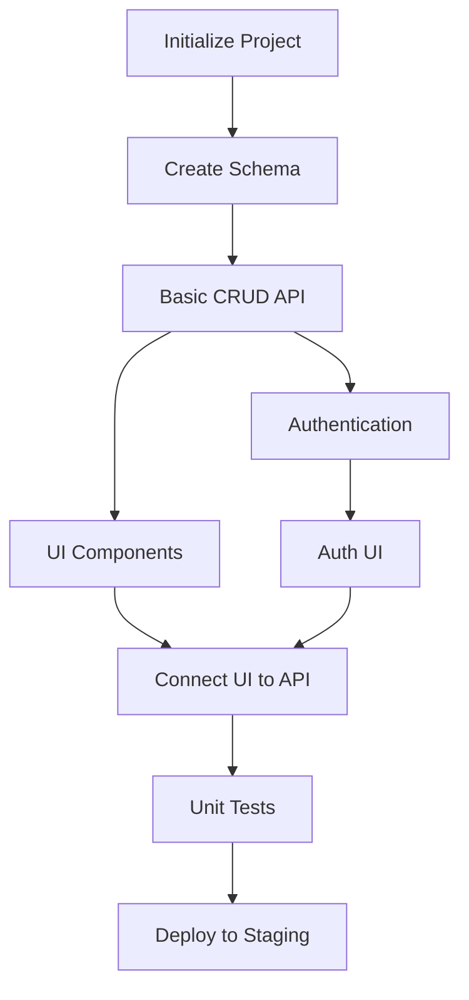

# Technical Design & Task Generator

Generate a comprehensive Technical Design Document with agent-executable implementation tasks for: **$ARGUMENTS**

## Phase 1: Input Analysis

First, determine the input source and extract requirements:

### Input Detection
1. If `$ARGUMENTS` is a file path (contains `.md` or starts with `/` or `./`):
   - Read the PRD from that file
   - Extract all requirements, user stories, and success metrics
2. If `$ARGUMENTS` contains "prd" in the path:
   - Search for matching PRD files
   - Use the most recent one
3. Otherwise:
   - Check for recent `prd_*.md` files in `/docs/prd/` or project root
   - If none exist, treat `$ARGUMENTS` as feature description
   - Generate a brief PRD first (using summary format)

### Requirement Extraction
From the PRD, extract and analyze:
- **Functional Requirements**: Core features to implement
- **Non-Functional Requirements**: Performance, security, scale requirements
- **User Stories**: User journeys and acceptance criteria
- **Success Metrics**: How to measure completion
- **Dependencies**: External systems and constraints
- **Timeline**: Expected delivery milestones

## Phase 2: Technical Design Generation

Generate a comprehensive TDD with these sections:

### 1. System Architecture
```markdown
## Architecture Overview
- Component diagram showing system boundaries
- Service interactions and data flow
- Technology stack decisions with rationale
- Deployment architecture (dev/staging/prod)

## Design Decisions
For each major decision:
- **Decision**: [What was chosen]
- **Alternatives Considered**: [Other options evaluated]
- **Rationale**: [Why this approach]
- **Trade-offs**: [Pros and cons]
```

### 2. Implementation Design
```markdown
## Component Specifications
For each component:
- **Component Name**: [Descriptive name]
- **Responsibility**: [Single clear purpose]
- **Interface**: [API/contract definition]
- **Dependencies**: [What it needs]
- **State Management**: [How state is handled]

## Data Design
- **Models**: Entity definitions with types
- **Storage**: Database/cache strategy
- **Migrations**: Schema evolution approach
- **Validation**: Data integrity rules
```

### 3. Agent-Executable Task List

Generate tasks using the COSTAR framework with explicit agent instructions:

```yaml
# Task Template Structure
task_id: [unique_id]
name: "[Imperative action description]"
type: [setup|implementation|testing|deployment]
priority: [P0|P1|P2]
dependencies: [list of task_ids]
estimated_time: "[X minutes/hours]"

agent_prompt: |
  # CONTEXT
  You are implementing [specific component] for [feature name].
  Current state: [What exists already]
  This task contributes to: [Overall goal]

  # OBJECTIVE
  [Single, specific technical goal]
  Success looks like: [Concrete success criteria]

  # STYLE & APPROACH
  - Follow existing patterns in [relevant files/directories]
  - Use [specific framework/library] conventions
  - Prioritize [specific quality attribute]

  # SPECIFICATIONS
  Input: [Expected inputs with types]
  Output: [Expected outputs with types]
  Constraints: [Technical limitations]

  # IMPLEMENTATION STEPS
  1. [First concrete action with file path]
  2. [Second concrete action with specifics]
  3. [Continue with clear, actionable steps]

  # VALIDATION
  - [ ] [Specific test to verify success]
  - [ ] [Another verification step]
  - [ ] [Final validation check]

tools_required: [Read, Write, Edit, Bash, etc.]
files_to_modify: [Specific file paths]
files_to_create: [New files needed]

validation_script: |
  # Bash commands to verify task completion
  npm test path/to/test
  grep -q "expected_pattern" file.ts

success_criteria:
  - "Test file exists at path/to/test"
  - "All tests pass with >80% coverage"
  - "No TypeScript errors"
```

### 4. Task Organization

#### Task Categories
```yaml
setup_tasks:
  - Project structure initialization
  - Dependency installation
  - Configuration files
  - Development environment

data_tasks:
  - Database schema creation
  - Migration scripts
  - Seed data
  - Data validation

api_tasks:
  - Endpoint implementation
  - Request/response handling
  - Authentication/authorization
  - Error handling

frontend_tasks:
  - Component creation
  - State management
  - UI/UX implementation
  - Form validation

integration_tasks:
  - Service connections
  - Third-party integrations
  - Webhook handlers
  - Message queue setup

testing_tasks:
  - Unit tests
  - Integration tests
  - E2E tests
  - Performance tests

deployment_tasks:
  - Build configuration
  - CI/CD pipeline
  - Environment setup
  - Monitoring/logging
```

#### Dependency Graph


### 5. Execution Plan

#### Phase-Based Execution
```markdown
## Phase 1: Foundation (Day 1-2)
**Goal**: Set up project structure and core infrastructure
**Tasks**: setup_001, setup_002, data_001
**Validation**: Development environment fully functional

## Phase 2: Core Implementation (Day 3-5)
**Goal**: Implement primary functionality
**Tasks**: api_001-api_005, frontend_001-frontend_003
**Validation**: Basic features working end-to-end

## Phase 3: Enhancement (Day 6-7)
**Goal**: Add secondary features and polish
**Tasks**: integration_001-integration_003
**Validation**: All user stories satisfied

## Phase 4: Quality & Deployment (Day 8-9)
**Goal**: Testing, optimization, and deployment
**Tasks**: testing_001-testing_004, deployment_001
**Validation**: Production-ready with monitoring
```

#### Critical Path
Identify the minimum sequence of tasks for MVP:
1. setup_001 → data_001 → api_001 → frontend_001 → testing_001

#### Parallel Execution Opportunities
Tasks that can run concurrently:
- Group A: [api_002, api_003] - Independent API endpoints
- Group B: [frontend_001, frontend_002] - Separate UI components
- Group C: [testing_001, testing_002] - Different test suites

## Phase 3: Output Generation

### File Structure
Generate three interconnected documents:

#### 1. Technical Design Document
**Filename**: `tdd_[feature_name]_[YYYYMMDD].md`
**Contents**:
- Architecture overview
- Design decisions
- Implementation specifications
- Testing strategy
- Deployment plan
- Risk assessment

#### 2. Task List
**Filename**: `tasks_[feature_name]_[YYYYMMDD].yaml`
**Contents**:
- All tasks in YAML format
- Dependency relationships
- Agent prompts
- Validation criteria
- Execution order

#### 3. Execution Script
**Filename**: `execute_[feature_name].md`
**Contents**:
```markdown
# Automated Implementation: [Feature Name]

## Pre-Implementation Setup
- [ ] PRD reviewed and approved
- [ ] TDD reviewed by team
- [ ] Development environment ready
- [ ] Git branch created

## Phase 1: Foundation Tasks
### Setup Infrastructure
/agent general-purpose "Execute task setup_001 from @tasks_[feature].yaml"

## Phase 2: Core Implementation
### Run Implementation Tasks in Parallel
Execute these tasks concurrently:
/agent general-purpose "Execute tasks api_001, api_002, api_003 from @tasks_[feature].yaml"
/agent general-purpose "Execute tasks frontend_001, frontend_002 from @tasks_[feature].yaml"

### Integration
/agent general-purpose "Execute integration tasks from @tasks_[feature].yaml ensuring API and frontend are connected"

## Phase 3: Testing & Validation
### Run Test Suite
/agent general-purpose "Execute all testing tasks from @tasks_[feature].yaml"

### Validation Checklist
- [ ] All unit tests passing (>80% coverage)
- [ ] Integration tests successful
- [ ] No TypeScript errors
- [ ] No linting warnings
- [ ] Performance benchmarks met
- [ ] Security scan clean

## Phase 4: Documentation & Deployment
### Update Documentation
/agent general-purpose "Update README and API documentation based on implementation"

### Deploy to Staging
/agent general-purpose "Execute deployment_001 from @tasks_[feature].yaml"

## Phase 4: Task Quality Assurance

### Task Validation Rules
Each task must have:
1. **Clear Objective**: Single, specific goal
2. **Concrete Steps**: Actionable instructions with file paths
3. **Measurable Success**: Specific validation criteria
4. **Tool Specification**: Exact tools needed
5. **Time Estimate**: Realistic duration
6. **Dependencies**: Explicit prerequisite tasks

### Agent Instruction Quality
Ensure each agent prompt includes:
- **Context Setting**: Current state and goal
- **Specific Actions**: Step-by-step instructions
- **File References**: Exact paths and patterns to follow
- **Validation Steps**: How to verify completion
- **Error Handling**: What to do if something fails

### Example High-Quality Task
```yaml
task_id: api_user_auth_001
name: "Implement JWT authentication endpoint"
type: implementation
priority: P0
dependencies: [setup_001, data_001]
estimated_time: "45 minutes"

agent_prompt: |
  # CONTEXT
  You are implementing JWT authentication for the user API.
  The Express server is set up at src/server.ts.
  Database models exist at src/models/User.ts.

  # OBJECTIVE
  Create POST /api/auth/login endpoint that:
  - Accepts email/password
  - Validates credentials
  - Returns JWT token
  - Handles errors appropriately

  # SPECIFICATIONS
  Input: { email: string, password: string }
  Output: { token: string, user: UserDTO }
  Errors: 401 for invalid credentials, 400 for missing fields

  # IMPLEMENTATION STEPS
  1. Create src/routes/auth.ts with Express router
  2. Implement login handler with:
     - Input validation using express-validator
     - Password verification using bcrypt
     - JWT generation using jsonwebtoken
  3. Add error handling middleware
  4. Register route in src/server.ts
  5. Create src/routes/auth.test.ts with:
     - Valid login test
     - Invalid password test
     - Missing fields test

  # VALIDATION
  - [ ] Endpoint responds at POST /api/auth/login
  - [ ] Returns JWT token for valid credentials
  - [ ] Returns 401 for invalid password
  - [ ] Returns 400 for missing fields
  - [ ] All tests pass

tools_required: [Read, Write, Edit, Bash(npm test:*)]
files_to_modify: [src/server.ts]
files_to_create: [src/routes/auth.ts, src/routes/auth.test.ts]

validation_script: |
  npm test src/routes/auth.test.ts
  curl -X POST localhost:3000/api/auth/login \
    -H "Content-Type: application/json" \
    -d '{"email":"test@example.com","password":"testpass"}'

success_criteria:
  - "auth.ts exports Express router"
  - "Tests achieve >90% coverage"
  - "JWT tokens are valid and contain user ID"
```

## Output Requirements

The command must generate:

1. **Comprehensive TDD** (tdd_*.md)
   - Complete technical specification
   - All architectural decisions
   - Risk mitigation strategies

2. **Executable Task List** (tasks_*.yaml)
   - 10-20 specific tasks for typical feature
   - Each task independently executable
   - Clear dependency chain

3. **Automation Script** (execute_*.md)
   - Step-by-step execution plan
   - Parallel execution where possible
   - Validation checkpoints

All documents must be:
- **Agent-Ready**: Any LLM agent can execute tasks without additional context
- **Self-Contained**: Each task has all information needed
- **Measurable**: Success criteria are specific and testable
- **Maintainable**: Easy to modify and extend

## Success Metrics

The generated task list succeeds when:
- ✅ An agent can execute each task independently
- ✅ Tasks complete in estimated time
- ✅ All validation criteria pass
- ✅ The feature works end-to-end
- ✅ Code quality metrics are met
- ✅ Documentation is complete

Generate timestamp at bottom: `Generated: [YYYY-MM-DD HH:MM:SS]`