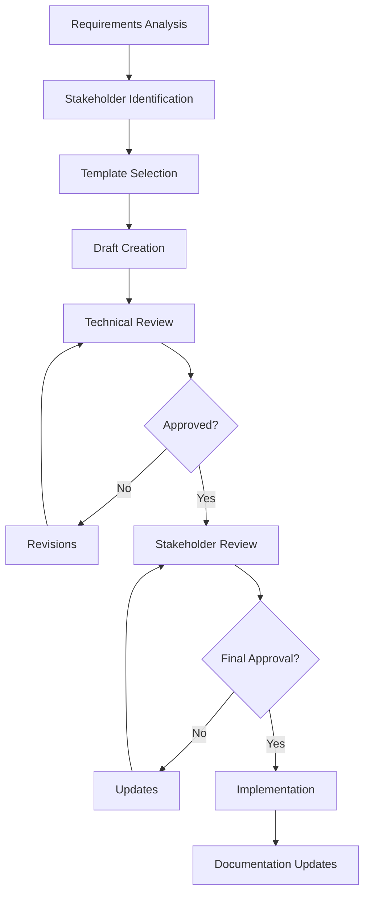

# Technical Design Document (TDD) Comprehensive Guide

*Research compiled on 2025-09-17*

## Table of Contents

1. [Quick Reference](#quick-reference)
2. [Document Types Comparison](#document-types-comparison)
3. [TDD Templates by Scenario](#tdd-templates-by-scenario)
4. [Real-World Examples](#real-world-examples)
5. [Best Practices](#best-practices)
6. [Anti-Patterns & Common Mistakes](#anti-patterns--common-mistakes)
7. [Tools & Platforms](#tools--platforms)
8. [Process Workflows](#process-workflows)
9. [Methodology Integration](#methodology-integration)
10. [Specialized TDD Types](#specialized-tdd-types)

---

## Quick Reference

### What is a Technical Design Document (TDD)?

A TDD describes a solution to a specific technical problem. It is a specification or "design blueprint" for a software program or feature that communicates technical details to team members. TDDs bridge the gap between system architecture and actual codebase implementation.

### Core Components (Essential)

1. **Overview & Problem Statement**
2. **Goals & Non-Goals**
3. **System Architecture**
4. **API Design & Interfaces**
5. **Data Model & Storage**
6. **Security Considerations**
7. **Testing Strategy**
8. **Deployment & Operations**
9. **Risk Assessment**
10. **Timeline & Milestones**

### When to Write a TDD

- Non-trivial system changes with dependencies
- New feature implementation requiring architectural decisions
- System integration or migration projects
- When solution impacts multiple teams/services
- Before significant refactoring efforts

---

## Document Types Comparison

| Document Type | Purpose | Timing | Focus | Audience |
|---------------|---------|--------|-------|----------|
| **PRD** (Product Requirements Document) | Define what to build from user perspective | First | User needs, market requirements | Product, Business |
| **TDD** (Technical Design Document) | Define how to build the solution | After PRD | Implementation details, architecture | Engineering |
| **RFC** (Request for Comments) | Gather feedback on proposed solutions | Before implementation | Collaboration, consensus | Engineering, Stakeholders |
| **ADR** (Architecture Decision Record) | Record decisions made | After decisions | Decision history, rationale | Engineering, Future teams |

### Sequential Relationship

```
PRD → TRD (Technical Requirements) → TDD → Implementation → ADR
     ↑                                ↑
     RFC (for feedback)              RFC (for complex designs)
```

---

## TDD Templates by Scenario

### 1. General Software Feature Template

```markdown
# [Feature Name] Technical Design Document

## 1. Overview
- **Problem Statement**: What problem are we solving?
- **Solution Summary**: High-level approach (2-3 sentences)
- **Success Criteria**: How do we measure success?

## 2. Goals & Non-Goals
### Goals
- Primary objectives
- Success metrics

### Non-Goals
- Explicitly out of scope
- Future considerations

## 3. Background & Context
- Current system state
- Dependencies
- Constraints

## 4. Proposed Solution
### Architecture Overview
- High-level system diagram
- Component interactions
- Data flow

### Detailed Design
- Component specifications
- Algorithm descriptions
- Interface definitions

## 5. API Design
- Endpoint specifications
- Request/response formats
- Error handling

## 6. Data Model
- Schema design
- Migration strategy
- Performance considerations

## 7. Security & Privacy
- Authentication/authorization
- Data protection
- Compliance requirements

## 8. Testing Strategy
- Unit testing approach
- Integration testing
- Performance testing
- Security testing

## 9. Deployment Plan
- Rollout strategy
- Monitoring & observability
- Rollback procedures

## 10. Risks & Mitigation
- Technical risks
- Timeline risks
- Dependency risks

## 11. Timeline & Milestones
- Phase breakdown
- Dependencies
- Critical path

## 12. Appendix
- References
- Additional diagrams
- Proof of concepts
```

### 2. System Design Template (Large Scale)

```markdown
# [System Name] System Design Document

## 1. Executive Summary
- System purpose
- Key benefits
- Resource requirements

## 2. System Requirements
### Functional Requirements
- Core features
- User interactions
- Business logic

### Non-Functional Requirements
- Performance (throughput, latency)
- Scalability targets
- Availability requirements
- Security standards

## 3. System Architecture
### High-Level Architecture
- System topology
- Major components
- External dependencies

### Component Design
- Service boundaries
- Communication protocols
- Data persistence

### Scalability Design
- Horizontal scaling strategy
- Load balancing
- Caching strategy

## 4. Data Architecture
### Data Model
- Entity relationships
- Schema design
- Data lifecycle

### Storage Strategy
- Database selection
- Partitioning strategy
- Backup & recovery

## 5. API & Integration Design
### Internal APIs
- Service-to-service communication
- Message formats
- Error handling

### External Integrations
- Third-party services
- Webhook design
- Rate limiting

## 6. Infrastructure & Deployment
### Infrastructure Requirements
- Compute resources
- Network architecture
- Security zones

### Deployment Strategy
- CI/CD pipeline
- Environment management
- Blue-green deployment

## 7. Monitoring & Operations
### Observability
- Metrics collection
- Logging strategy
- Distributed tracing

### Alerting
- Critical alerts
- Performance monitoring
- Business metrics

## 8. Security Architecture
### Authentication & Authorization
- Identity management
- Access control
- Token management

### Data Security
- Encryption at rest/transit
- Data classification
- Privacy compliance

## 9. Disaster Recovery
### Backup Strategy
- Data backup procedures
- Recovery time objectives
- Recovery point objectives

### Failover Procedures
- System redundancy
- Geographic distribution
- Business continuity

## 10. Cost Analysis
### Infrastructure Costs
- Compute costs
- Storage costs
- Network costs

### Operational Costs
- Maintenance overhead
- Support requirements
- Scaling costs
```

### 3. API Design Document Template

```markdown
# [API Name] API Design Document

## 1. API Overview
- Purpose & scope
- Target audience
- Integration scenarios

## 2. API Design Principles
- RESTful design
- Consistency standards
- Versioning strategy

## 3. Authentication & Authorization
- Authentication methods
- Authorization model
- Token management

## 4. API Specification
### Base URL & Versioning
- Base URL structure
- Version management
- Deprecation policy

### Endpoints
For each endpoint:
- HTTP method & path
- Description
- Parameters
- Request body schema
- Response schema
- Error responses
- Examples

## 5. Data Models
- Entity definitions
- Relationship mappings
- Validation rules

## 6. Error Handling
- Error response format
- HTTP status codes
- Error message guidelines

## 7. Rate Limiting & Quotas
- Rate limiting strategy
- Quota management
- Throttling behavior

## 8. Testing & Documentation
- Test cases
- API documentation
- SDK considerations

## 9. Performance & Scalability
- Response time targets
- Throughput requirements
- Caching strategy

## 10. Monitoring & Analytics
- API metrics
- Usage analytics
- Performance monitoring
```

### 4. Database Design Document Template

```markdown
# [Database Name] Database Design Document

## 1. Database Overview
- Purpose & scope
- Database type selection
- Performance requirements

## 2. Data Requirements
### Entities & Relationships
- Entity definitions
- Relationship types
- Business rules

### Data Volume & Growth
- Current data size
- Growth projections
- Retention policies

## 3. Schema Design
### Logical Design
- Entity-relationship diagram
- Normalization level
- Data integrity constraints

### Physical Design
- Table structures
- Index strategies
- Partitioning scheme

## 4. Data Access Patterns
### Query Patterns
- Common queries
- Performance requirements
- Indexing strategy

### Transaction Patterns
- ACID requirements
- Isolation levels
- Deadlock prevention

## 5. Security & Privacy
### Access Control
- User roles & permissions
- Row-level security
- Column encryption

### Data Privacy
- PII handling
- Data masking
- Compliance requirements

## 6. Performance Optimization
### Indexing Strategy
- Primary indexes
- Secondary indexes
- Composite indexes

### Query Optimization
- Query patterns
- Execution plans
- Performance tuning

## 7. Backup & Recovery
### Backup Strategy
- Backup frequency
- Backup types
- Storage location

### Recovery Procedures
- Point-in-time recovery
- Disaster recovery
- Business continuity

## 8. Migration Strategy
### Data Migration
- Migration approach
- Data validation
- Rollback procedures

### Schema Evolution
- Version management
- Backward compatibility
- Deployment strategy
```

### 5. Microservices Architecture Template

```markdown
# [Service Name] Microservice Design Document

## 1. Service Overview
- Service purpose
- Business domain
- Service boundaries

## 2. Service Architecture
### Service Design
- Domain-driven design
- Bounded context
- Service responsibilities

### Communication Patterns
- Synchronous communication
- Asynchronous messaging
- Event-driven architecture

## 3. API Design
### Internal APIs
- Service contracts
- Message formats
- Protocol selection

### External APIs
- Public interface
- Client SDK
- Documentation

## 4. Data Management
### Data Ownership
- Data boundaries
- Data consistency
- Data synchronization

### Storage Strategy
- Database per service
- Shared data handling
- Event sourcing

## 5. Service Discovery & Configuration
### Service Registry
- Registration mechanism
- Health checks
- Load balancing

### Configuration Management
- Environment-specific config
- Secret management
- Dynamic configuration

## 6. Fault Tolerance
### Resilience Patterns
- Circuit breaker
- Retry mechanisms
- Bulkhead pattern

### Error Handling
- Error propagation
- Graceful degradation
- Fallback strategies

## 7. Monitoring & Observability
### Distributed Tracing
- Trace correlation
- Service dependencies
- Performance monitoring

### Metrics & Logging
- Service metrics
- Structured logging
- Centralized logging

## 8. Deployment & Operations
### Containerization
- Docker configuration
- Image management
- Runtime requirements

### Orchestration
- Kubernetes deployment
- Service mesh integration
- Rolling updates

## 9. Testing Strategy
### Unit Testing
- Test coverage
- Mock dependencies
- Test automation

### Integration Testing
- Contract testing
- End-to-end testing
- Chaos engineering

## 10. Security
### Service Security
- Inter-service authentication
- Authorization policies
- Network security

### Data Security
- Encryption standards
- Key management
- Audit logging
```

---

## Real-World Examples

### Google Design Docs

**Characteristics:**
- Created in Google Docs for collaboration
- Heavy use of commenting features
- Review process ranges from lightweight to formal
- Focus on trade-offs and decision rationale

**Key Sections:**
- Project title with authors
- Overview and background
- Goals and non-goals
- Implementation details
- Testing strategy
- Dependencies and timeline
- Risk assessment

**Best Practices:**
- Update docs for unshipped systems
- Create amendments for changes rather than rewriting
- Link amendments from original doc
- First question for new systems: "Where is the design doc?"

### Amazon 6-Pager Format

**Structure:**
1. **Introduction** - Clear setup and direction
2. **Goals** - SMART objectives and success metrics
3. **Tenets** - Guiding principles and north stars
4. **State of Business** - Current situation with data
5. **Lessons Learned** - What worked/didn't work with metrics
6. **Strategic Priorities** - Core recommendations

**Process:**
- Silent reading (20-30 minutes) at meeting start
- Narrative format instead of PowerPoint
- Appendix with unlimited supporting data
- 2-week writing process with multiple reviews

**Benefits:**
- Forces detailed thinking and specificity
- Better audience comprehension
- Self-contained documents
- Improved decision-making quality

### Microsoft Dynamics 365 Template

**Document Types:**
- **Functional Design Document (FDD)** - Business perspective
- **Technical Design Document (TDD)** - Technical perspective
- **Combined Document** - Both perspectives integrated

**Key Elements:**
- Business process descriptions
- Use cases and requirements
- Architecture and data model
- System interfaces and configurations
- Detailed implementation specifications

---

## Best Practices

### Writing Excellence

1. **Clarity Over Completeness**
   - Use simple, concise language
   - Avoid corporate jargon
   - Include visual aids (diagrams, flowcharts)
   - Structure with bullets and lists for scannability

2. **Collaboration Focus**
   - Use collaborative editors (Google Docs, Confluence)
   - Encourage comment-based communication
   - Partner comfortable writers with those who aren't
   - Get technical writer/editor feedback during writing

3. **Visual Communication**
   - Include architecture diagrams
   - Use data flow diagrams
   - Create sequence diagrams for interactions
   - Provide UI mockups where relevant

### Documentation Standards

1. **Consistent Templates**
   - Use single, consistent template across team
   - Maintain uniform terminology and layout
   - Follow naming conventions
   - Standardize diagram notation

2. **Maintenance Strategy**
   - Update docs during development
   - Mark version changes clearly
   - Create amendment documents for changes
   - Link related documents

3. **Review Process**
   - Mandatory peer reviews
   - Technical accuracy verification
   - Stakeholder alignment check
   - Architecture review for significant changes

### Content Guidelines

1. **Problem-First Approach**
   - Start with clear problem statement
   - Explain "why" before "what"
   - Include context and background
   - Define success criteria

2. **Solution Documentation**
   - Describe alternatives considered
   - Explain decision rationale
   - Include trade-off analysis
   - Document assumptions and constraints

3. **Implementation Details**
   - Provide enough detail for implementation
   - Include configuration examples
   - Specify interface contracts
   - Document error handling

### Quality Assurance

1. **Technical Accuracy**
   - Validate technical feasibility
   - Review performance implications
   - Check security considerations
   - Verify compliance requirements

2. **Completeness Checks**
   - Cover all requirements
   - Address non-functional requirements
   - Include testing strategy
   - Plan deployment approach

3. **Stakeholder Alignment**
   - Get business stakeholder review
   - Ensure technical team agreement
   - Validate with dependent teams
   - Confirm timeline feasibility

---

## Anti-Patterns & Common Mistakes

### Documentation Anti-Patterns

1. **Over-Engineering Documentation**
   - **Problem**: Creating overly complex docs for simple changes
   - **Impact**: Wasted time, delayed delivery
   - **Solution**: Match documentation effort to change complexity

2. **Documentation Debt**
   - **Problem**: Outdated docs that don't reflect current system
   - **Impact**: Confusion, wrong decisions, onboarding issues
   - **Solution**: Regular documentation review and updates

3. **Copy-Paste Documentation**
   - **Problem**: Copying sections without customization
   - **Impact**: Irrelevant information, lack of specificity
   - **Solution**: Tailor each section to specific project needs

4. **Waterfall Documentation in Agile**
   - **Problem**: Extensive upfront documentation in agile projects
   - **Impact**: Delayed development, outdated assumptions
   - **Solution**: Just-enough documentation, iterative updates

### Technical Design Anti-Patterns

1. **God Object/God Class**
   - **Problem**: Single component handling too many responsibilities
   - **Impact**: Hard to test, maintain, and understand
   - **Solution**: Follow single responsibility principle

2. **Spaghetti Architecture**
   - **Problem**: Unclear component relationships and data flow
   - **Impact**: System complexity, difficult debugging
   - **Solution**: Clear layered architecture, defined interfaces

3. **Golden Hammer**
   - **Problem**: Using familiar technology for every problem
   - **Impact**: Suboptimal solutions, missed opportunities
   - **Solution**: Evaluate each problem independently

4. **Premature Optimization**
   - **Problem**: Optimizing before understanding performance needs
   - **Impact**: Complex code, wasted effort
   - **Solution**: Measure first, then optimize

### Process Anti-Patterns

1. **Design by Committee**
   - **Problem**: Too many people involved in design decisions
   - **Impact**: Paralysis, compromised solutions
   - **Solution**: Clear decision makers, structured review process

2. **Big Design Up Front (BDUF)**
   - **Problem**: Attempting to design everything before coding
   - **Impact**: Analysis paralysis, obsolete designs
   - **Solution**: Iterative design, early prototyping

3. **No Design Documentation**
   - **Problem**: Skipping design docs entirely
   - **Impact**: Tribal knowledge, hard onboarding, inconsistent implementation
   - **Solution**: Minimum viable documentation

4. **Design Without Context**
   - **Problem**: Designing without understanding requirements or constraints
   - **Impact**: Unsuitable solutions, rework
   - **Solution**: Thorough requirements analysis

### Content Anti-Patterns

1. **Implementation Without Rationale**
   - **Problem**: Describing "what" without explaining "why"
   - **Impact**: Decisions seem arbitrary, hard to maintain
   - **Solution**: Document decision rationale and trade-offs

2. **Missing Non-Functional Requirements**
   - **Problem**: Focusing only on functional requirements
   - **Impact**: Performance, security, scalability issues
   - **Solution**: Include all requirement types

3. **Vague Success Criteria**
   - **Problem**: Unclear definition of success
   - **Impact**: Scope creep, never-ending projects
   - **Solution**: Specific, measurable success criteria

4. **Single Point of Failure Design**
   - **Problem**: Not considering failure scenarios
   - **Impact**: System outages, data loss
   - **Solution**: Design for failure, include redundancy

### How to Avoid Anti-Patterns

1. **Use Static Analysis Tools**
   - SonarQube, ESLint for code quality
   - Architecture fitness functions
   - Automated documentation checks

2. **Implement Review Processes**
   - Peer code reviews
   - Architecture review boards
   - Regular design retrospectives

3. **Follow Established Principles**
   - SOLID principles
   - Domain-driven design
   - Microservices patterns

4. **Continuous Learning**
   - Study successful systems
   - Learn from failures
   - Stay updated with best practices

---

## Tools & Platforms

### Documentation Platforms

#### **Confluence**
- **Pros**: Enterprise-grade, Jira integration, templates, collaboration
- **Cons**: Can be slow, complex for simple docs
- **Best For**: Large teams, process-heavy organizations
- **Features**: Page templates, comment threading, version control

#### **Notion**
- **Pros**: Flexible, modern UI, database integration, templates
- **Cons**: Performance with large docs, limited enterprise features
- **Best For**: Startups, flexible documentation needs
- **Features**: 30,000+ templates, GitHub integration, collaborative editing

#### **GitHub/GitLab**
- **Pros**: Version control, code proximity, markdown support
- **Cons**: Limited formatting, not ideal for non-technical stakeholders
- **Best For**: Open source, developer-centric teams
- **Features**: PR reviews, issue linking, wiki pages

#### **Google Docs**
- **Pros**: Real-time collaboration, commenting, accessibility
- **Cons**: Limited technical formatting, version control
- **Best For**: Google-centric organizations, quick collaboration
- **Features**: Comment threads, suggestion mode, easy sharing

### Diagramming Tools

#### **Draw.io (diagrams.net)**
- **Pros**: Free, integrates with various platforms, extensive shapes
- **Cons**: Can be complex for beginners
- **Best For**: Technical diagrams, architecture charts

#### **Lucidchart**
- **Pros**: Professional templates, real-time collaboration
- **Cons**: Paid service, can be expensive for large teams
- **Best For**: Business process diagrams, system architecture

#### **Miro/Mural**
- **Pros**: Infinite canvas, great for workshops, sticky notes
- **Cons**: Can become messy, not ideal for formal docs
- **Best For**: Design thinking, collaborative workshops

#### **PlantUML**
- **Pros**: Code-based diagrams, version control friendly
- **Cons**: Learning curve, limited visual customization
- **Best For**: Technical teams, automated documentation

### API Documentation Tools

#### **Swagger/OpenAPI**
- **Pros**: Industry standard, code generation, interactive docs
- **Cons**: Learning curve, limited customization
- **Features**: Spec-driven development, mock servers, client generation

#### **Postman**
- **Pros**: Testing integration, easy to use, collaboration features
- **Cons**: Can become expensive, limited customization
- **Features**: Collection sharing, automated testing, mock servers

#### **GitBook**
- **Pros**: Beautiful presentation, GitHub sync, search
- **Cons**: Paid for advanced features, limited technical features
- **Features**: Git integration, collaborative editing, analytics

### Database Documentation

#### **DbSchema**
- **Pros**: Visual schema design, documentation generation
- **Cons**: Java-based, licensing costs
- **Features**: HTML/PDF export, reverse engineering

#### **SchemaHero**
- **Pros**: GitOps approach, Kubernetes native
- **Cons**: Limited database support, new tool
- **Features**: Declarative schemas, CI/CD integration

### Template Repositories

#### **GitHub Templates**
- Ready-to-use TDD templates for various scenarios
- Language-specific templates
- Integration with development workflows

#### **Company-Specific Templates**
- Google Docs templates (public)
- Microsoft templates (Dynamics 365)
- Open-source alternatives (Docmost)

### AI-Assisted Documentation

#### **GitHub Copilot**
- Code comment generation
- Documentation template suggestions
- Technical writing assistance

#### **Notion AI**
- Content generation
- Template creation
- Writing improvement suggestions

### Automation Tools

#### **Documentation as Code**
- Sphinx for Python projects
- JSDoc for JavaScript
- Rustdoc for Rust projects

#### **CI/CD Integration**
- Automated documentation builds
- Link checking
- Spell checking
- Template validation

---

## Process Workflows

### TDD Creation Workflow



### Agile Integration Workflow

#### Sprint Planning Integration
1. **Epic/Feature Planning**
   - Create high-level design during epic planning
   - Define architecture decisions
   - Identify cross-team dependencies

2. **Sprint Planning**
   - Refine design for upcoming sprint
   - Create user story-level technical designs
   - Update implementation details

3. **Sprint Execution**
   - Update design docs as implementation progresses
   - Document decisions made during development
   - Create ADRs for significant choices

4. **Sprint Review**
   - Review design doc accuracy
   - Update for next sprint planning
   - Share learnings with broader team

#### Documentation in Definition of Done
- Technical design documented
- Architecture reviewed and approved
- Implementation matches design
- Documentation updated for changes

### Review Process

#### Lightweight Review
- **When**: Simple changes, internal team features
- **Process**: Share with team, collect comments, implement feedback
- **Timeline**: 2-3 days

#### Formal Review
- **When**: Major architecture changes, cross-team impact
- **Process**: Architecture review board, formal presentation, written approval
- **Timeline**: 1-2 weeks

#### Review Checklist
- [ ] Problem clearly defined
- [ ] Solution addresses all requirements
- [ ] Trade-offs documented
- [ ] Security considerations included
- [ ] Performance implications addressed
- [ ] Testing strategy defined
- [ ] Deployment plan outlined
- [ ] Risk mitigation strategies included

### Maintenance Workflow

#### Regular Updates
- **Frequency**: With each major change
- **Scope**: Implementation details, new decisions
- **Owner**: Development team

#### Quarterly Reviews
- **Frequency**: Every 3 months
- **Scope**: Overall accuracy, outdated sections
- **Owner**: Technical lead + architect

#### Annual Audit
- **Frequency**: Yearly
- **Scope**: Complete document review, template updates
- **Owner**: Architecture team

---

## Methodology Integration

### Agile/Scrum Integration

#### Principles
- **Working software over comprehensive documentation**
- **Just enough** documentation to enable development
- **Iterative** documentation that evolves with the product
- **Collaborative** documentation created by the team

#### Implementation Strategies

1. **User Story Level Design**
   - Each user story has associated technical design
   - Design documented in story acceptance criteria
   - Attach design docs to user stories in tracking tools

2. **Sprint-Level Documentation**
   - Update documentation during sprint work
   - Include documentation tasks in sprint planning
   - Review documentation accuracy in sprint retrospectives

3. **Epic-Level Architecture**
   - Create high-level design during epic planning
   - Define architecture decisions before sprint work begins
   - Update architectural decisions as epics progress

#### Best Practices
- Make documentation part of Definition of Done
- Use collaborative tools that integrate with development workflow
- Keep documentation close to code (e.g., in repositories)
- Focus on decisions and rationale rather than exhaustive details

### Waterfall Integration

#### Sequential Documentation
1. **Requirements Phase**
   - Document functional requirements
   - Define non-functional requirements
   - Create traceability matrix

2. **Design Phase**
   - High-level system design
   - Detailed component design
   - Interface specifications

3. **Implementation Phase**
   - Implementation guides
   - Code documentation standards
   - Change management process

4. **Testing Phase**
   - Test plan documentation
   - Test case specifications
   - Defect management process

#### Documentation Gates
- Requirements review before design
- Design review before implementation
- Implementation review before testing
- Documentation sign-off at each phase

### Hybrid Approaches

#### Scrumban Integration
- **Kanban flow** for documentation tasks
- **Scrum ceremonies** for design reviews
- **Waterfall planning** for major architectural decisions

#### Design-First Agile
- **Upfront design** for major features
- **Iterative implementation** with design updates
- **Continuous validation** of design decisions

#### SAFe Integration
- **Portfolio level**: Architecture runway documentation
- **Program level**: Solution design documentation
- **Team level**: Feature and story design documentation

---

## Specialized TDD Types

### Microservices Architecture

#### Service Boundary Design
```markdown
## Service Boundaries
### Domain Model
- Bounded contexts
- Entity relationships
- Business rules

### Service Responsibilities
- Core capabilities
- Data ownership
- API contracts

### Integration Patterns
- Synchronous communication
- Asynchronous messaging
- Event-driven architecture
```

#### Inter-Service Communication
- API contracts and versioning
- Message queue design
- Event schema definitions
- Circuit breaker patterns
- Retry and timeout strategies

#### Data Management
- Database per service pattern
- Data consistency strategies
- Event sourcing design
- CQRS implementation
- Data synchronization patterns

### Cloud-Native Applications

#### Infrastructure as Code
```markdown
## Infrastructure Design
### Cloud Resources
- Compute requirements
- Storage specifications
- Network configuration

### Deployment Strategy
- Container orchestration
- Service mesh configuration
- CI/CD pipeline design

### Observability
- Monitoring strategy
- Logging aggregation
- Distributed tracing
```

#### Scalability Patterns
- Horizontal scaling strategies
- Load balancing design
- Caching layers
- CDN integration
- Auto-scaling policies

### Data-Intensive Applications

#### Data Pipeline Design
```markdown
## Data Architecture
### Data Sources
- Input data formats
- Data validation rules
- Ingestion strategies

### Processing Pipeline
- ETL/ELT processes
- Data transformation rules
- Quality assurance checks

### Data Storage
- Data lake design
- Data warehouse schema
- Real-time data stores
```

#### Analytics and ML Integration
- Feature engineering pipelines
- Model training infrastructure
- Model serving architecture
- A/B testing framework
- Data governance policies

### Security-Critical Systems

#### Security Architecture
```markdown
## Security Design
### Threat Model
- Asset identification
- Threat analysis
- Risk assessment

### Security Controls
- Authentication mechanisms
- Authorization policies
- Data encryption

### Compliance
- Regulatory requirements
- Audit trails
- Privacy controls
```

#### Zero-Trust Architecture
- Identity verification
- Device compliance
- Network segmentation
- Continuous monitoring
- Least privilege access

### Real-Time Systems

#### Performance Requirements
```markdown
## Performance Design
### Latency Requirements
- End-to-end latency targets
- Component-level SLAs
- Performance budgets

### Throughput Requirements
- Transaction volume
- Peak load handling
- Capacity planning

### Reliability Requirements
- Availability targets
- Fault tolerance
- Disaster recovery
```

#### Stream Processing Architecture
- Event streaming platforms
- Complex event processing
- Real-time analytics
- State management
- Backpressure handling

---

## Conclusion

Technical Design Documents are critical tools for successful software development, serving as blueprints that guide implementation while facilitating communication and decision-making across teams. This guide provides comprehensive templates, best practices, and real-world examples to help create effective TDDs that enhance project success.

### Key Takeaways

1. **Match Documentation to Complexity**: Use appropriate templates and depth based on project size and impact
2. **Focus on Decisions and Trade-offs**: Document not just what you're building, but why
3. **Maintain Living Documents**: Keep documentation updated as systems evolve
4. **Collaborate Early and Often**: Use documentation as a tool for building consensus
5. **Avoid Anti-Patterns**: Learn from common mistakes to create better designs
6. **Choose Right Tools**: Select platforms and tools that fit your team's workflow
7. **Integrate with Methodology**: Adapt documentation practices to your development approach

### Getting Started

1. **Assess Your Needs**: Determine what type of TDD you need based on project scope
2. **Select a Template**: Choose from the templates provided or adapt them to your context
3. **Set Up Tools**: Configure your documentation platform and diagramming tools
4. **Define Process**: Establish review and maintenance workflows
5. **Start Small**: Begin with simpler projects to build documentation habits
6. **Iterate and Improve**: Continuously refine your approach based on feedback and results

Remember: The goal of technical design documentation is not perfection, but clarity, communication, and guidance for successful implementation. Focus on creating documents that serve your team and project needs effectively.

---

*This guide compiles research from industry best practices, real-world examples, and proven methodologies. Continue to adapt and evolve these practices based on your specific context and requirements.*