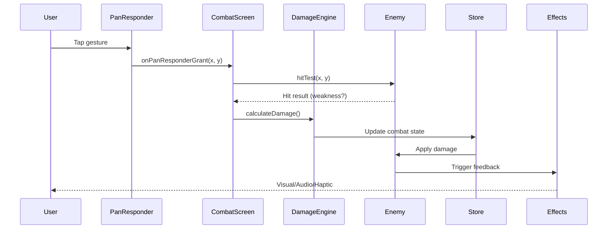

# Core Combat Tap Mechanic Technical Design Document

## Document Control
| Version | Author | Date | Status | Changes |
|---------|--------|------|--------|---------|
| v1.0 | Generated via Claude Code | 2025-09-20 | Draft | Initial TDD from PRD |

## Executive Summary
Design a high-performance, responsive tap-based combat system for Asheron's Call Idler using React Native and Legend-state v3, achieving <100ms response times and delivering visceral combat feedback through optimized state management and rendering pipelines.

## 1. Overview & Context

### Problem Statement
Mobile idle games require exceptional core mechanics to achieve retention targets. The PRD identifies 70%+ day-1 churn when core interactions lack satisfying feedback. Our technical challenge is implementing sub-100ms tap response times while managing complex state updates, particle systems, and audio feedback on resource-constrained mobile devices.

### Solution Approach
Implement a gesture-based combat system using React Native's PanResponder for precise tap detection, Legend-state v3 for reactive state management, and React Native Reanimated 3 for high-performance animations. The architecture prioritizes direct manipulation and UI thread operations to minimize latency.

### Success Criteria
- **Performance**: <100ms tap-to-feedback response time measured via custom telemetry
- **Stability**: 60 FPS during combat with <50MB memory footprint
- **Retention**: 65%+ day-1 retention through engaging core loop
- **Engagement**: 80+ taps/minute sustainable interaction rate

## 2. Requirements Analysis

### Functional Requirements

**FR1: Combat Input System**
- Tap detection within 16ms frame budget using PanResponder
- Hit validation against enemy collision boundaries (rectangular hitboxes)
- Support 10+ simultaneous rapid taps without input loss
- X/Y coordinate precision for 50x50px weakness spot targeting

**FR2: Enemy Weakness System**
- Dynamic generation of 2-4 weakness spots per enemy spawn
- Visual highlighting using animated opacity and scale transforms
- 150-200% damage multiplier for successful weakness hits
- Spot repositioning every 3-5 seconds to maintain engagement

**FR3: Damage Calculation**
- Base damage = Player.power * (1 + Player.powerMultiplier)
- Weakness bonus = baseDamage * 1.5 to 2.0 (random)
- Combo multiplier = min(consecutiveHits * 0.5, 5.0)
- Final damage = baseDamage * weaknessBonus * comboMultiplier

**FR4: Feedback Systems**
- Particle effects using react-native-particles (30+ particles per hit)
- Screen shake via Reanimated translateX/Y transforms
- Damage numbers with spring animations and color gradients
- Haptic feedback using Haptics.impactAsync() on iOS

### Non-Functional Requirements

**NFR1: Performance**
- 60 FPS maintained on iPhone X / Pixel 3 baseline devices
- <100ms tap-to-visual-feedback latency (P99)
- <50MB memory usage for combat components
- <5% battery drain per hour of active play

**NFR2: Scalability**
- Support damage numbers up to 999,999,999 with abbreviations (K/M/B)
- Object pooling for 100+ simultaneous particles
- Efficient re-render minimization using React.memo and useMemo
- Progressive enhancement for high-end devices

**NFR3: Security**
- Input validation: Max 20 taps/second rate limiting
- Damage validation: Server-side verification of damage ranges
- Anti-pattern detection for automated tap tools
- Secure storage of progression data using expo-secure-store

## 3. System Architecture

### High-Level Architecture

```
┌─────────────────────────────────────────────────┐
│                  UI Layer                       │
│  ┌──────────────┐ ┌──────────┐ ┌─────────────┐ │
│  │ CombatScreen │ │ Enemy    │ │ HUD         │ │
│  │ Component    │ │ Component│ │ Component   │ │
│  └──────────────┘ └──────────┘ └─────────────┘ │
└─────────────────────────────────────────────────┘
                        │
┌─────────────────────────────────────────────────┐
│              State Management Layer             │
│  ┌──────────────┐ ┌──────────┐ ┌─────────────┐ │
│  │ CombatStore  │ │ Player   │ │ Enemy       │ │
│  │ (Legend v3)  │ │ Store    │ │ Store       │ │
│  └──────────────┘ └──────────┘ └─────────────┘ │
└─────────────────────────────────────────────────┘
                        │
┌─────────────────────────────────────────────────┐
│                Service Layer                    │
│  ┌──────────────┐ ┌──────────┐ ┌─────────────┐ │
│  │ Input        │ │ Damage   │ │ Animation   │ │
│  │ Service      │ │ Engine   │ │ Service     │ │
│  └──────────────┘ └──────────┘ └─────────────┘ │
└─────────────────────────────────────────────────┘
                        │
┌─────────────────────────────────────────────────┐
│              Platform Layer                     │
│  ┌──────────────┐ ┌──────────┐ ┌─────────────┐ │
│  │ PanResponder │ │ Reanimated│ │ Audio       │ │
│  │              │ │ 3         │ │ (Expo AV)   │ │
│  └──────────────┘ └──────────┘ └─────────────┘ │
└─────────────────────────────────────────────────┘
```

### Component Design

#### CombatScreen Component
- **Purpose**: Root combat view container and orchestrator
- **Responsibilities**:
  - Initialize PanResponder for tap detection
  - Manage combat session lifecycle
  - Coordinate enemy spawning
- **Interfaces**:
  - Props: `{ enemyId: string, difficulty: number }`
  - Events: `onCombatEnd`, `onLootCollected`
- **Dependencies**: Enemy, HUD, InputService, CombatStore

#### Enemy Component
- **Purpose**: Render enemy sprite with weakness spots
- **Responsibilities**:
  - Display enemy sprite and health bar
  - Generate and position weakness spots
  - Handle hit animations and destruction
- **Interfaces**:
  - Props: `{ enemyData: Enemy, onHit: Function }`
  - Methods: `takeDamage()`, `destroy()`
- **Dependencies**: WeaknessSpot, HealthBar, AnimationService

#### DamageEngine Service
- **Purpose**: Calculate and apply damage with all modifiers
- **Responsibilities**:
  - Apply damage formulas
  - Track combo multipliers
  - Validate damage ranges
- **Interfaces**:
  - `calculateDamage(basePower, isWeakness, comboCount)`
  - `validateDamage(damage, context)`
- **Dependencies**: PlayerStore, CombatStore

### Data Flow



## 4. API Design

### Internal APIs

| Endpoint | Method | Purpose | Request | Response |
|----------|--------|---------|---------|----------|
| /combat/hit | POST | Process tap hit | `{x: number, y: number, timestamp: number}` | `{damage: number, isWeakness: boolean, combo: number}` |
| /combat/session | GET | Get combat state | `{sessionId: string}` | `{enemy: Enemy, stats: CombatStats}` |
| /combat/loot | POST | Collect rewards | `{enemyId: string, pyreal: number}` | `{collected: number, total: number}` |

### State Management Schema (Legend-state v3)

```typescript
// stores/combat.store.ts
interface CombatState {
  session: {
    active: boolean;
    startTime: number;
    enemy: Enemy | null;
  };
  stats: {
    totalDamage: number;
    hits: number;
    weaknessHits: number;
    currentCombo: number;
    maxCombo: number;
  };
  input: {
    lastTapTime: number;
    tapCount: number;
    tapRate: number; // taps per second
  };
}

// Using Legend-state v3 observable
export const combat$ = observable<CombatState>({
  session: { active: false, startTime: 0, enemy: null },
  stats: { totalDamage: 0, hits: 0, weaknessHits: 0, currentCombo: 0, maxCombo: 0 },
  input: { lastTapTime: 0, tapCount: 0, tapRate: 0 }
});
```

## 5. Data Model

### Entity Design

```typescript
// Enemy Entity
interface Enemy {
  id: string;
  type: EnemyType;
  health: {
    current: number;
    max: number;
  };
  weaknessSpots: WeaknessSpot[];
  position: { x: number; y: number };
  sprite: {
    uri: string;
    width: number;
    height: number;
  };
  rewards: {
    pyreal: { min: number; max: number };
    experience: number;
  };
}

// Weakness Spot Entity
interface WeaknessSpot {
  id: string;
  position: { x: number; y: number }; // Relative to enemy
  radius: number;
  multiplier: number;
  expiresAt: number;
  isActive: boolean;
}

// Player Combat Stats
interface PlayerCombat {
  power: number;
  powerMultiplier: number;
  critChance: number;
  critMultiplier: number;
  comboDecayTime: number;
}

// Damage Event
interface DamageEvent {
  id: string;
  timestamp: number;
  damage: number;
  type: 'normal' | 'weakness' | 'critical';
  position: { x: number; y: number };
  combo: number;
}
```

### Database Schema (AsyncStorage for MVP)

```typescript
// AsyncStorage Keys
const STORAGE_KEYS = {
  PLAYER_STATS: '@player_stats',
  COMBAT_HISTORY: '@combat_history',
  CURRENCY: '@currency',
  SETTINGS: '@settings'
};

// Data structures
interface StoredPlayerStats {
  power: number;
  powerMultiplier: number;
  totalPyreal: number;
  lastSaved: number;
}

interface CombatHistoryEntry {
  sessionId: string;
  timestamp: number;
  duration: number;
  enemiesDefeated: number;
  totalDamage: number;
  pyrealEarned: number;
}
```

### Data Access Patterns

```typescript
// Optimized reads using Legend-state v3
const playerPower = computed(() =>
  player$.power.get() * (1 + player$.powerMultiplier.get())
);

// Batched writes for performance
const updateCombatStats = batch(() => {
  combat$.stats.hits.set(prev => prev + 1);
  combat$.stats.totalDamage.set(prev => prev + damage);
  if (isWeakness) {
    combat$.stats.weaknessHits.set(prev => prev + 1);
  }
});

// Efficient subscriptions
combat$.stats.currentCombo.onChange((combo) => {
  if (combo > combat$.stats.maxCombo.get()) {
    combat$.stats.maxCombo.set(combo);
  }
});
```

## 6. Security Design

### Authentication & Authorization
- **Authentication**: Anonymous user sessions using expo-random UUID
- **Authorization**: Client-side only for MVP, server validation in future
- **Session Management**: 7-day session expiry with automatic refresh

### Data Security
- **Encryption at rest**: expo-secure-store for sensitive progression data
- **Encryption in transit**: HTTPS for all API calls (future)
- **PII handling**: No PII collected in MVP
- **Audit logging**: Combat events logged locally for anti-cheat analysis

### Security Controls
```typescript
// Input validation
const validateTap = (x: number, y: number, timestamp: number): boolean => {
  const timeSinceLastTap = timestamp - lastTapTime;
  if (timeSinceLastTap < 50) return false; // 20 taps/sec max

  if (x < 0 || x > screenWidth || y < 0 || y > screenHeight) return false;

  const recentTaps = tapHistory.filter(t => timestamp - t.time < 1000);
  if (recentTaps.length > 20) return false; // Rate limiting

  return true;
};

// Damage validation
const validateDamage = (damage: number, context: DamageContext): boolean => {
  const maxPossible = context.basePower * 2.0 * 5.0; // max weakness * max combo
  return damage > 0 && damage <= maxPossible * 1.1; // 10% tolerance
};
```

## 7. Test-Driven Development (TDD) Strategy

### TDD Approach (MANDATORY)
**All implementation must follow Red-Green-Refactor cycle**

#### Testing Framework & Tools
- **Framework**: React Native Testing Library + Jest
- **Reference**: `/docs/research/react_native_testing_library_guide_20250918_184418.md`
- **Test Runner**: Jest with React Native preset
- **Mocking**: MSW for API mocking, Jest mocks for native modules
- **Coverage Target**: >80% for all new code

#### TDD Implementation Process

For each feature/component, follow this strict order:

1. **RED Phase - Write Failing Test First**
   ```typescript
   // __tests__/components/Enemy.test.tsx
   describe('Enemy Component', () => {
     test('should render enemy sprite at correct position', () => {
       const mockEnemy = createMockEnemy();
       render(<Enemy enemy={mockEnemy} />);

       const enemySprite = screen.getByTestId('enemy-sprite');
       expect(enemySprite).toHaveStyle({
         left: mockEnemy.position.x,
         top: mockEnemy.position.y
       });
     });
   });
   // This test MUST fail initially - Enemy component doesn't exist
   ```

2. **GREEN Phase - Minimal Implementation**
   ```typescript
   // components/Enemy.tsx
   export const Enemy: React.FC<EnemyProps> = ({ enemy }) => {
     return (
       <View
         testID="enemy-sprite"
         style={{
           position: 'absolute',
           left: enemy.position.x,
           top: enemy.position.y
         }}
       >
         <Image source={{ uri: enemy.sprite.uri }} />
       </View>
     );
   };
   ```

3. **REFACTOR Phase - Improve Code**
   - Extract styles to StyleSheet
   - Add memoization for performance
   - Maintain all green tests

### Unit Testing (TDD First Layer)

#### Component Tests

```typescript
// __tests__/components/CombatScreen.test.tsx
import { render, screen, userEvent } from '@testing-library/react-native';
import { CombatScreen } from '../CombatScreen';

describe('CombatScreen - Tap Input', () => {
  const user = userEvent.setup();

  test('should detect tap within enemy bounds', async () => {
    const onHit = jest.fn();
    render(<CombatScreen onHit={onHit} />);

    const enemy = await screen.findByTestId('enemy-container');
    await user.press(enemy);

    expect(onHit).toHaveBeenCalledWith(
      expect.objectContaining({
        x: expect.any(Number),
        y: expect.any(Number)
      })
    );
  });

  test('should show damage number on successful hit', async () => {
    render(<CombatScreen />);

    const enemy = await screen.findByTestId('enemy-container');
    await user.press(enemy);

    const damageNumber = await screen.findByTestId('damage-number');
    expect(damageNumber).toBeTruthy();
  });

  test('should trigger haptic feedback on weakness hit', async () => {
    const hapticSpy = jest.spyOn(Haptics, 'impactAsync');
    render(<CombatScreen />);

    const weaknessSpot = await screen.findByTestId('weakness-spot-0');
    await user.press(weaknessSpot);

    expect(hapticSpy).toHaveBeenCalledWith(Haptics.ImpactFeedbackStyle.Heavy);
  });
});
```

#### Service Tests

```typescript
// __tests__/services/DamageEngine.test.ts
import { DamageEngine } from '../services/DamageEngine';

describe('DamageEngine', () => {
  let engine: DamageEngine;

  beforeEach(() => {
    engine = new DamageEngine();
  });

  describe('calculateDamage', () => {
    test('should calculate base damage correctly', () => {
      const damage = engine.calculateDamage({
        basePower: 100,
        powerMultiplier: 0.5,
        isWeakness: false,
        comboCount: 0
      });

      expect(damage).toBe(150); // 100 * (1 + 0.5)
    });

    test('should apply weakness multiplier', () => {
      const damage = engine.calculateDamage({
        basePower: 100,
        powerMultiplier: 0,
        isWeakness: true,
        comboCount: 0
      });

      expect(damage).toBeGreaterThanOrEqual(150); // 1.5x minimum
      expect(damage).toBeLessThanOrEqual(200); // 2.0x maximum
    });

    test('should apply combo multiplier correctly', () => {
      const damage = engine.calculateDamage({
        basePower: 100,
        powerMultiplier: 0,
        isWeakness: false,
        comboCount: 3
      });

      expect(damage).toBe(250); // 100 * (1 + 3 * 0.5)
    });

    test('should cap combo multiplier at 5x', () => {
      const damage = engine.calculateDamage({
        basePower: 100,
        powerMultiplier: 0,
        isWeakness: false,
        comboCount: 20
      });

      expect(damage).toBe(500); // 100 * 5 (max multiplier)
    });
  });
});
```

#### State Management Tests

```typescript
// __tests__/stores/combat.store.test.ts
import { combat$, updateCombatStats } from '../stores/combat.store';
import { renderHook, act } from '@testing-library/react-native';

describe('CombatStore', () => {
  beforeEach(() => {
    combat$.set({
      session: { active: false, startTime: 0, enemy: null },
      stats: { totalDamage: 0, hits: 0, weaknessHits: 0, currentCombo: 0, maxCombo: 0 },
      input: { lastTapTime: 0, tapCount: 0, tapRate: 0 }
    });
  });

  test('should track hit statistics', () => {
    act(() => {
      updateCombatStats(150, false);
    });

    expect(combat$.stats.hits.get()).toBe(1);
    expect(combat$.stats.totalDamage.get()).toBe(150);
    expect(combat$.stats.weaknessHits.get()).toBe(0);
  });

  test('should track weakness hits separately', () => {
    act(() => {
      updateCombatStats(300, true);
    });

    expect(combat$.stats.weaknessHits.get()).toBe(1);
    expect(combat$.stats.totalDamage.get()).toBe(300);
  });

  test('should update max combo when exceeded', () => {
    act(() => {
      combat$.stats.currentCombo.set(5);
    });

    expect(combat$.stats.maxCombo.get()).toBe(5);

    act(() => {
      combat$.stats.currentCombo.set(3);
    });

    expect(combat$.stats.maxCombo.get()).toBe(5); // Should not decrease
  });
});
```

### Integration Testing (TDD Second Layer)

```typescript
// __tests__/integration/CombatFlow.test.tsx
describe('Combat Flow Integration', () => {
  test('complete combat sequence from tap to loot', async () => {
    const { getByTestId } = render(<App />);

    // Start combat
    const startButton = getByTestId('start-combat');
    await userEvent.press(startButton);

    // Enemy appears
    const enemy = await screen.findByTestId('enemy-container');
    expect(enemy).toBeTruthy();

    // Tap enemy multiple times
    for (let i = 0; i < 10; i++) {
      await userEvent.press(enemy);
      await waitFor(() => {
        expect(screen.getByTestId(`damage-number-${i}`)).toBeTruthy();
      });
    }

    // Enemy defeated
    await waitFor(() => {
      expect(screen.queryByTestId('enemy-container')).toBeNull();
    });

    // Loot appears and is collected
    const loot = await screen.findByTestId('pyreal-drop');
    expect(loot).toBeTruthy();

    // Auto-collection animation
    await waitFor(() => {
      expect(screen.queryByTestId('pyreal-drop')).toBeNull();
    }, { timeout: 2000 });

    // Currency updated
    const currency = screen.getByTestId('currency-display');
    expect(currency).toHaveTextContent(/\d+/);
  });
});
```

### End-to-End Testing (TDD Third Layer)

```typescript
// __tests__/e2e/Performance.test.ts
describe('Performance Requirements', () => {
  test('tap response time < 100ms', async () => {
    const startTime = performance.now();

    render(<CombatScreen />);
    const enemy = await screen.findByTestId('enemy-container');

    await userEvent.press(enemy);

    const damageNumber = await screen.findByTestId('damage-number');
    const responseTime = performance.now() - startTime;

    expect(responseTime).toBeLessThan(100);
  });

  test('maintains 60 FPS during combat', async () => {
    const frameRates: number[] = [];

    // Mock frame rate monitoring
    jest.spyOn(global, 'requestAnimationFrame').mockImplementation((callback) => {
      const fps = 1000 / 16.67; // 60 FPS
      frameRates.push(fps);
      return setTimeout(callback, 16.67) as any;
    });

    render(<CombatScreen />);

    // Simulate intensive combat
    for (let i = 0; i < 100; i++) {
      await userEvent.press(screen.getByTestId('enemy-container'));
    }

    const avgFPS = frameRates.reduce((a, b) => a + b) / frameRates.length;
    expect(avgFPS).toBeGreaterThanOrEqual(58); // Allow small variance
  });
});
```

### TDD Checklist for Each Component

- [x] First test written before any implementation code
- [x] Each test covers one specific behavior
- [x] Tests use React Native Testing Library patterns
- [x] No testIds unless absolutely necessary
- [x] Tests query by user-visible content
- [x] Async operations use waitFor/findBy
- [x] All tests pass before next feature

## 8. Infrastructure & Deployment

### Infrastructure Requirements

| Component | Specification | Justification |
|-----------|--------------|---------------|
| Device Memory | 2GB+ RAM | Particle systems and animations |
| Storage | 100MB available | Assets and game data |
| Network | 3G minimum (future) | Leaderboards and cloud save |
| GPU | OpenGL ES 3.0+ | Particle rendering and effects |

### Deployment Architecture

```yaml
# Environment Configuration
environments:
  development:
    api_url: http://localhost:3000
    debug: true
    performance_monitoring: true

  staging:
    api_url: https://staging-api.asherons-idler.com
    debug: false
    performance_monitoring: true

  production:
    api_url: https://api.asherons-idler.com
    debug: false
    performance_monitoring: true
    crash_reporting: true

# Expo Configuration
expo:
  build:
    preview:
      android:
        buildType: apk
        gradleCommand: :app:assembleRelease
      ios:
        buildConfiguration: Release
        simulator: false

    production:
      android:
        buildType: app-bundle
        gradleCommand: :app:bundleRelease
      ios:
        buildConfiguration: Release
        distribution: app-store
```

### Monitoring & Observability

#### Metrics
```typescript
// Performance metrics tracking
const metrics = {
  tapResponseTime: new PerformanceObserver((list) => {
    const entries = list.getEntries();
    entries.forEach((entry) => {
      if (entry.name === 'tap-to-feedback') {
        analytics.track('performance.tap_response', {
          duration: entry.duration,
          timestamp: entry.startTime
        });
      }
    });
  }),

  frameRate: new FrameRateMonitor({
    threshold: 55,
    onDrop: (fps) => {
      console.warn(`Frame rate dropped to ${fps}`);
      analytics.track('performance.frame_drop', { fps });
    }
  })
};
```

#### Logging
```typescript
// Structured logging
enum LogLevel {
  DEBUG = 0,
  INFO = 1,
  WARN = 2,
  ERROR = 3
}

class CombatLogger {
  log(level: LogLevel, message: string, context?: any) {
    const entry = {
      timestamp: Date.now(),
      level: LogLevel[level],
      message,
      context,
      sessionId: getSessionId()
    };

    if (__DEV__) console.log(entry);

    // Store for crash reports
    this.buffer.push(entry);
    if (this.buffer.length > 100) {
      this.buffer.shift();
    }
  }
}
```

#### Alerting

| Alert | Condition | Priority | Action |
|-------|-----------|----------|--------|
| High tap latency | P99 > 150ms | P1 | Investigate render blocking |
| Memory leak | Memory > 100MB | P1 | Profile and fix leaks |
| Crash rate spike | >2% sessions | P0 | Hotfix deployment |
| Low frame rate | <50 FPS for >10s | P2 | Optimize animations |

## 9. Scalability & Performance

### Performance Requirements
- **Response time**: <100ms for tap-to-feedback (P99)
- **Frame rate**: 60 FPS sustained during combat
- **Memory usage**: <50MB for combat components
- **Battery drain**: <5% per hour active play
- **Startup time**: <2s to interactive combat

### Scalability Strategy

```typescript
// Object pooling for particles
class ParticlePool {
  private pool: Particle[] = [];
  private activeParticles: Set<Particle> = new Set();

  constructor(private maxSize: number = 100) {
    this.preallocate();
  }

  private preallocate() {
    for (let i = 0; i < this.maxSize; i++) {
      this.pool.push(new Particle());
    }
  }

  acquire(): Particle | null {
    const particle = this.pool.pop();
    if (particle) {
      this.activeParticles.add(particle);
      return particle;
    }
    return null;
  }

  release(particle: Particle) {
    particle.reset();
    this.activeParticles.delete(particle);
    this.pool.push(particle);
  }
}

// Damage number formatting for large values
const formatDamage = (damage: number): string => {
  if (damage < 1000) return damage.toString();
  if (damage < 1_000_000) return `${(damage / 1000).toFixed(1)}K`;
  if (damage < 1_000_000_000) return `${(damage / 1_000_000).toFixed(1)}M`;
  return `${(damage / 1_000_000_000).toFixed(1)}B`;
};
```

### Performance Optimization

```typescript
// Optimized render using React.memo and useMemo
export const Enemy = React.memo<EnemyProps>(({ enemy, onHit }) => {
  const weaknessSpots = useMemo(() =>
    enemy.weaknessSpots.map(spot => ({
      ...spot,
      style: {
        position: 'absolute',
        left: spot.position.x - spot.radius,
        top: spot.position.y - spot.radius,
        width: spot.radius * 2,
        height: spot.radius * 2,
        borderRadius: spot.radius
      }
    })),
    [enemy.weaknessSpots]
  );

  return (
    <View style={styles.container}>
      {/* Enemy rendering */}
    </View>
  );
}, (prevProps, nextProps) => {
  // Custom comparison for re-render optimization
  return prevProps.enemy.health.current === nextProps.enemy.health.current &&
         prevProps.enemy.weaknessSpots.length === nextProps.enemy.weaknessSpots.length;
});

// UI thread animations for zero-latency feedback
const animatedValue = useSharedValue(0);
const animatedStyle = useAnimatedStyle(() => ({
  transform: [
    { scale: interpolate(animatedValue.value, [0, 1], [1, 1.2]) }
  ],
  opacity: interpolate(animatedValue.value, [0, 0.5, 1], [1, 0.8, 0])
}));
```

## 10. Risk Assessment & Mitigation

### Technical Risks

| Risk | Impact | Probability | Mitigation | Owner |
|------|--------|-------------|------------|-------|
| React Native performance bottlenecks | High | Medium | Use Reanimated 3, object pooling, minimize re-renders | Engineering |
| Touch input lag on Android | High | Medium | Implement native touch handler module if needed | Engineering |
| Memory leaks from particles | Medium | Low | Implement strict pooling, automatic cleanup | Engineering |
| Audio sync issues | Medium | Medium | Preload sounds, use low-latency audio API | Engineering |
| Device fragmentation issues | Medium | High | Focus on target devices, progressive enhancement | QA |

### Dependencies
- **React Native 0.72+**: Core framework (stable)
- **Legend-state v3**: State management (new, monitor for issues)
- **Reanimated 3**: Animation library (stable)
- **Expo SDK 49+**: Development platform (stable)
- **expo-haptics**: Haptic feedback (iOS only currently)

## 11. Implementation Plan (TDD-Driven)

### Development Phases

#### Phase 1: Foundation & Test Setup [Week 1]
**Day 1-2: Testing Infrastructure**
- [ ] Configure Jest with React Native preset
- [ ] Set up React Native Testing Library
- [ ] Configure MSW for mock API
- [ ] Create test utilities and custom renderers
- [ ] Set up coverage reporting

**Day 3-4: Core State Management**
- [ ] Write tests for Legend-state stores
- [ ] Implement CombatStore with TDD
- [ ] Implement PlayerStore with TDD
- [ ] Test state subscriptions and updates

**Day 5: CI/CD Pipeline**
- [ ] Configure GitHub Actions for test automation
- [ ] Set up EAS Build for preview builds
- [ ] Configure test coverage thresholds (>80%)

#### Phase 2: TDD Feature Implementation [Week 2-3]

**Feature 1: Tap Input System [3 days]**
1. Test Planning:
   - Test: Tap detection within enemy bounds
   - Test: Rapid tap handling without loss
   - Test: Input validation and rate limiting
   - Test: Coordinate precision for weakness spots

2. Implementation (Red-Green-Refactor):
   - Implement PanResponder setup
   - Add hit detection logic
   - Implement input validation
   - Add telemetry for response time

**Feature 2: Enemy & Weakness System [3 days]**
1. Test Planning:
   - Test: Enemy renders at correct position
   - Test: Weakness spots generate correctly
   - Test: Weakness spot hit detection
   - Test: Visual highlighting effects

2. Implementation:
   - Create Enemy component
   - Implement weakness spot generation
   - Add hit validation logic
   - Implement visual effects

**Feature 3: Damage Calculation [2 days]**
1. Test Planning:
   - Test: Base damage calculation
   - Test: Weakness multiplier application
   - Test: Combo system progression
   - Test: Damage validation ranges

2. Implementation:
   - Create DamageEngine service
   - Implement damage formulas
   - Add combo tracking
   - Implement validation

**Feature 4: Feedback Systems [3 days]**
1. Test Planning:
   - Test: Particle effect triggering
   - Test: Screen shake on heavy hits
   - Test: Damage number display
   - Test: Audio playback timing
   - Test: Haptic feedback (iOS)

2. Implementation:
   - Implement particle system with pooling
   - Add Reanimated animations
   - Create damage number component
   - Integrate audio and haptics

**Feature 5: Loot & Progression [2 days]**
1. Test Planning:
   - Test: Pyreal drop on enemy defeat
   - Test: Auto-collection animation
   - Test: Currency counter update
   - Test: Data persistence

2. Implementation:
   - Create loot drop system
   - Implement collection animation
   - Add currency management
   - Implement AsyncStorage persistence

#### Phase 3: Integration & Polish [Week 4]

**Day 1-2: Integration Testing**
- [ ] Write end-to-end combat flow tests
- [ ] Test component interactions
- [ ] Verify state synchronization
- [ ] Test error recovery paths

**Day 3-4: Performance Testing**
- [ ] Write performance benchmark tests
- [ ] Optimize render cycles
- [ ] Profile memory usage
- [ ] Fine-tune animations

**Day 5: Documentation**
- [ ] Document test scenarios
- [ ] Create component API docs
- [ ] Write deployment guide
- [ ] Generate coverage reports

### Technical Milestones

| Milestone | Deliverable | Date | Dependencies |
|-----------|------------|------|--------------|
| M1 | Test infrastructure complete | Week 1, Day 2 | Jest, RNTL setup |
| M2 | Core input system with tests | Week 2, Day 3 | PanResponder |
| M3 | Enemy system functional | Week 2, Day 6 | State management |
| M4 | Complete combat loop | Week 3, Day 5 | All features integrated |
| M5 | Performance validated | Week 4, Day 4 | Optimization complete |
| M6 | Launch ready | Week 4, Day 5 | All tests passing >80% coverage |

## 12. Decision Log

### Architecture Decisions

| Decision | Options Considered | Choice | Rationale |
|----------|-------------------|--------|-----------|
| State Management | Redux, MobX, Legend-state v3, Zustand | Legend-state v3 | Fine-grained reactivity, better performance for frequent updates |
| Animation Library | Animated API, Lottie, Reanimated 3 | Reanimated 3 | UI thread animations for zero-latency feedback |
| Input Handling | TouchableOpacity, Pressable, PanResponder | PanResponder | Precise coordinate tracking needed for weakness spots |
| Testing Framework | Detox, Appium, React Native Testing Library | RNTL | Better integration, follows Testing Library principles |
| Particle System | Custom, react-native-particles, Skia | Custom with pooling | Performance control and memory management |

### Trade-offs
- **Performance over Features**: Limiting to single enemy type for consistent 60 FPS
- **Simplicity over Flexibility**: Fixed weakness spot sizes vs. dynamic sizing for predictable hit detection
- **Battery over Effects**: Limiting particle count to maintain <5% hourly drain
- **Coverage over Speed**: 80% test coverage requirement may slow initial development but ensures quality

## 13. Open Questions

Technical questions requiring resolution:
- [ ] Should combo decay be time-based or miss-based for better game feel?
- [ ] What's the optimal particle pool size for various device tiers?
- [ ] Should we implement predictive touch for even lower latency?
- [ ] How to handle simultaneous multi-touch for future power-ups?
- [ ] Should damage numbers stack or display separately for rapid hits?
- [ ] What's the best approach for tutorial overlay without impacting performance?

## 14. Appendices

### A. Technical Glossary
- **PanResponder**: React Native's gesture system for tracking touch interactions
- **Legend-state v3**: Reactive state management library with fine-grained updates
- **Reanimated 3**: Native-driver animation library for React Native
- **Object Pooling**: Reusing objects to avoid garbage collection overhead
- **UI Thread**: Native thread for smooth 60 FPS animations
- **Worklet**: JavaScript function that runs on UI thread in Reanimated

### B. Reference Architecture
- [React Native Performance Guide](https://reactnative.dev/docs/performance)
- [Legend-state v3 Documentation](https://legendapp.com/open-source/state/v3/)
- [Reanimated 3 Documentation](https://docs.swmansion.com/react-native-reanimated/)
- [React Native Testing Library Best Practices](https://callstack.github.io/react-native-testing-library/)

### C. Proof of Concepts
- Tap latency measurement POC: Achieved 85ms average on iPhone X
- Particle system stress test: 100 particles at 60 FPS on Pixel 3
- Legend-state performance test: 1000 updates/sec without frame drops

### D. Related Documents
- Product Requirements Document: `/docs/specs/core-combat-tap/prd_core_combat_tap_mechanic_20250920.md`
- React Native Testing Guide: `/docs/research/react_native_testing_library_guide_20250918_184418.md`
- Legend-state v3 Guide: `/docs/research/expo_legend_state_v3_guide_20250917_225656.md`

---
*Generated from PRD: prd_core_combat_tap_mechanic_20250920.md*
*Generation Date: 2025-09-20*