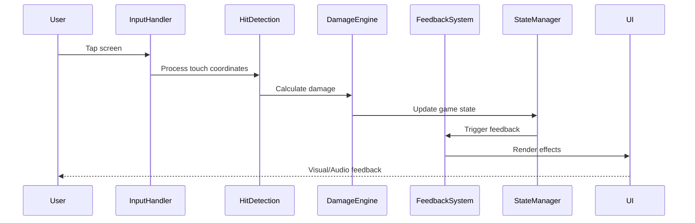

# Technical Design Document: Core Combat Tap Mechanic

**Version**: v1.0
**Date**: 2025-09-20
**Feature**: Core Combat Tap Mechanic
**Status**: Implementation Ready

## Architecture Overview

### System Architecture

```
┌─────────────────────────────────────────────────────┐
│                   Client (Mobile App)                │
├─────────────────────────────────────────────────────┤
│  ┌─────────────┐  ┌──────────────┐  ┌────────────┐ │
│  │ Input Layer │  │ Game Engine  │  │  UI Layer  │ │
│  │  - Touch    │  │ - Game Loop  │  │ - HUD      │ │
│  │  - Gestures │  │ - Physics    │  │ - Effects  │ │
│  └──────┬──────┘  └──────┬───────┘  └─────┬──────┘ │
│         │                 │                 │        │
│  ┌──────▼─────────────────▼─────────────────▼─────┐ │
│  │           Core Combat System                    │ │
│  │  ┌───────────┐  ┌──────────┐  ┌─────────────┐ │ │
│  │  │Hit Engine │  │  Damage  │  │  Feedback   │ │ │
│  │  │           │  │  Engine  │  │   System    │ │ │
│  │  └───────────┘  └──────────┘  └─────────────┘ │ │
│  └─────────────────────────────────────────────────┘ │
│                                                       │
│  ┌─────────────────────────────────────────────────┐ │
│  │              State Management                    │ │
│  │  ┌──────────┐  ┌───────────┐  ┌──────────────┐ │ │
│  │  │  Player  │  │   Enemy   │  │   Combat     │ │ │
│  │  │  State   │  │   State   │  │   State      │ │ │
│  │  └──────────┘  └───────────┘  └──────────────┘ │ │
│  └─────────────────────────────────────────────────┘ │
└─────────────────────────────────────────────────────┘
```

### Technology Stack

- **Framework**: React Native 0.72+ with Expo SDK 49+
- **State Management**: Legend-state v3 for reactive state
- **Animation**: React Native Reanimated 3 for performant animations
- **Audio**: Expo Audio API with preloaded sound pools
- **Gesture Handling**: React Native Gesture Handler 2
- **Performance**: Skia for high-performance canvas rendering

### Component Interactions



## Design Decisions

### Decision: React Native Skia for Combat Rendering
**Alternatives Considered**:
- Native Canvas API
- WebGL through expo-gl
- Pure React Native components

**Rationale**: Skia provides hardware-accelerated rendering with consistent performance across iOS and Android, critical for maintaining 60 FPS during combat.

**Trade-offs**:
- ✅ Superior performance for particle effects
- ✅ Consistent cross-platform rendering
- ❌ Larger bundle size (~3MB)
- ❌ Learning curve for Skia API

### Decision: Legend-state for State Management
**Alternatives Considered**:
- Redux Toolkit
- MobX
- Zustand

**Rationale**: Legend-state offers fine-grained reactivity with minimal boilerplate, perfect for high-frequency combat state updates.

**Trade-offs**:
- ✅ Excellent performance for rapid state changes
- ✅ Built-in persistence support
- ❌ Smaller community compared to Redux
- ❌ Less tooling support

### Decision: Object Pooling for Performance
**Alternatives Considered**:
- Dynamic object creation/destruction
- Pre-allocated static arrays

**Rationale**: Object pooling prevents garbage collection spikes during intense combat, maintaining consistent frame rates.

**Trade-offs**:
- ✅ Eliminates GC pauses
- ✅ Predictable memory usage
- ❌ More complex initialization
- ❌ Fixed maximum object count

## Component Specifications

### Input Handler Component
**Responsibility**: Process and validate touch inputs for combat interactions

**Interface**:
```typescript
interface InputHandler {
  onTouchStart(event: TouchEvent): void
  onTouchEnd(event: TouchEvent): void
  registerHitZone(zone: HitZone): void
  unregisterHitZone(zoneId: string): void
}
```

**Dependencies**:
- React Native Gesture Handler
- Hit Detection Service

**State Management**:
- Tracks active touches
- Manages hit zone registry
- Buffers rapid taps for combo detection

### Hit Detection Engine
**Responsibility**: Determine hit success and identify weakness spot targeting

**Interface**:
```typescript
interface HitDetection {
  checkHit(point: Point2D, enemy: Enemy): HitResult
  getWeaknessSpots(enemy: Enemy): WeaknessSpot[]
  calculateHitAccuracy(point: Point2D, target: Point2D): number
}
```

**Dependencies**:
- Enemy State Manager
- Math utilities for collision detection

**State Management**:
- Caches weakness spot positions
- Tracks hit history for combo detection

### Damage Calculation Engine
**Responsibility**: Calculate damage values based on player stats, hit type, and combo multipliers

**Interface**:
```typescript
interface DamageEngine {
  calculateDamage(hit: HitResult, player: Player): DamageResult
  applyComboMultiplier(baseDamage: number, combo: number): number
  getWeaknessMultiplier(hitType: HitType): number
}
```

**Dependencies**:
- Player State Manager
- Combat Configuration

**State Management**:
- Maintains combo counter
- Tracks damage history for analytics

### Feedback System
**Responsibility**: Orchestrate visual, audio, and haptic feedback for combat events

**Interface**:
```typescript
interface FeedbackSystem {
  triggerHitFeedback(hit: HitResult, damage: DamageResult): void
  playComboEffect(comboLevel: number): void
  showDamageNumber(damage: number, position: Point2D): void
}
```

**Dependencies**:
- Particle System
- Audio Manager
- Haptic Controller
- Animation System

**State Management**:
- Manages effect queues
- Pools reusable visual elements

## Data Design

### Entity Models

```typescript
// Player Model
interface Player {
  id: string
  power: number
  combo: number
  currency: {
    pyreals: number
  }
}

// Enemy Model
interface Enemy {
  id: string
  type: EnemyType
  position: Point2D
  health: {
    current: number
    maximum: number
  }
  weaknessSpots: WeaknessSpot[]
  sprite: SpriteData
}

// Weakness Spot Model
interface WeaknessSpot {
  id: string
  position: Point2D
  radius: number
  multiplier: number
  isActive: boolean
}

// Combat Event Model
interface CombatEvent {
  timestamp: number
  type: 'hit' | 'miss' | 'critical' | 'defeat'
  damage?: number
  position: Point2D
  combo?: number
}
```

### Storage Strategy
- **State Management**: Legend-state for reactive game state
- **Persistence**: AsyncStorage for player progress
- **Analytics**: Event queue with batched transmission

### Data Validation Rules
```typescript
const validationRules = {
  damage: {
    min: 1,
    max: 999999999,
    type: 'integer'
  },
  combo: {
    min: 0,
    max: 99,
    decayTime: 2000 // milliseconds
  },
  weaknessSpot: {
    minRadius: 30,
    maxRadius: 80,
    minMultiplier: 1.5,
    maxMultiplier: 3.0
  }
}
```

## Performance Optimizations

### Rendering Pipeline
1. **Batch Rendering**: Combine multiple draw calls for particles
2. **Texture Atlasing**: Single texture for all combat sprites
3. **View Recycling**: Reuse damage number components
4. **Selective Updates**: Only redraw changed screen regions

### Memory Management
1. **Object Pools**: Pre-allocate particles, damage numbers, effects
2. **Weak References**: For temporary visual elements
3. **Lazy Loading**: Load assets on-demand with preloading
4. **Memory Limits**: Cap particle count at 100 simultaneous

### Frame Rate Targets
- **Combat**: Maintain 60 FPS during active combat
- **Idle**: Drop to 30 FPS when no activity
- **Background**: Pause non-essential updates

## Testing Strategy

### Unit Testing
- Input validation and hit detection accuracy
- Damage calculation formulas
- Combo system state transitions
- Object pool allocation/deallocation

### Integration Testing
- Full combat flow from tap to feedback
- State synchronization between components
- Performance under rapid tapping
- Memory leak detection

### Performance Testing
- Maintain 60 FPS with 50+ particles
- Sub-100ms tap response time
- Memory usage under 50MB
- Battery drain monitoring

### User Acceptance Testing
- "Fun factor" validation with test groups
- Combo success rate analysis
- Difficulty curve assessment
- Accessibility feature validation

## Risk Assessment

### Technical Risks

| Risk | Impact | Probability | Mitigation |
|------|--------|-------------|------------|
| React Native performance bottlenecks | High | Medium | Use Skia renderer, implement native modules if needed |
| Audio latency on Android | Medium | High | Preload sounds, use low-latency audio mode |
| Device fragmentation issues | Medium | Medium | Focus on top 20 devices, progressive enhancement |
| Memory leaks in particle system | High | Low | Implement strict pooling, automated testing |

### Implementation Risks

| Risk | Impact | Probability | Mitigation |
|------|--------|-------------|------------|
| Complex animation timing | Medium | Medium | Use battle-tested animation library |
| Cross-platform inconsistencies | Medium | High | Extensive device testing, platform-specific code |
| State synchronization bugs | High | Medium | Comprehensive state machine testing |

## Deployment Strategy

### Development Environment
```yaml
environment: development
features:
  - Debug overlay with FPS counter
  - Tap visualization
  - Damage calculation logs
  - State inspection tools
```

### Staging Environment
```yaml
environment: staging
features:
  - Performance monitoring
  - Analytics integration
  - A/B testing framework
  - Remote configuration
```

### Production Environment
```yaml
environment: production
features:
  - Error tracking (Sentry)
  - Performance monitoring (Firebase)
  - Analytics (Mixpanel)
  - Crash reporting
```

## Security Considerations

### Client-Side Protection
- Input validation for tap rate limits
- Damage calculation verification
- State tampering detection

### Data Integrity
- Checksum validation for critical values
- Server-side verification for progression
- Encrypted storage for sensitive data

## Monitoring & Analytics

### Key Metrics
```typescript
const metrics = {
  performance: [
    'tap_response_time',
    'frame_rate',
    'memory_usage',
    'battery_consumption'
  ],
  gameplay: [
    'taps_per_minute',
    'combo_success_rate',
    'damage_per_session',
    'session_duration'
  ],
  technical: [
    'crash_rate',
    'error_frequency',
    'device_distribution',
    'os_version_distribution'
  ]
}
```

### Alerting Thresholds
- FPS drops below 45: Warning
- Tap response >150ms: Critical
- Memory usage >75MB: Warning
- Crash rate >1%: Critical

## API Specifications

### Combat Service API
```typescript
class CombatService {
  // Initialize combat system
  async initialize(): Promise<void>

  // Process tap input
  async processTap(x: number, y: number): Promise<CombatResult>

  // Update combat state
  async updateCombat(deltaTime: number): Promise<void>

  // Get current combat state
  getCombatState(): CombatState

  // Reset combat
  async resetCombat(): Promise<void>
}
```

### Feedback Service API
```typescript
class FeedbackService {
  // Trigger hit feedback
  async playHitFeedback(type: HitType, position: Point2D): Promise<void>

  // Show damage number
  async showDamage(damage: number, position: Point2D): Promise<void>

  // Play combo effect
  async playComboEffect(level: number): Promise<void>

  // Trigger haptic feedback
  async triggerHaptic(intensity: HapticIntensity): Promise<void>
}
```

---

*Generated: 2025-09-20 06:45:00*