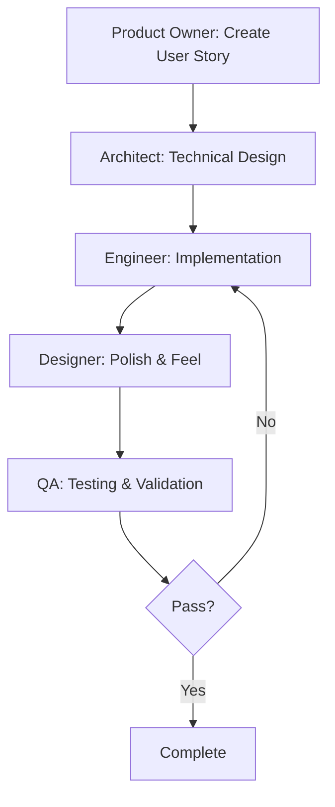

# Product Requirements Prompt (PRP): PetSoft Tycoon - Professional Edition

## Document Metadata
- **Version**: 2.0
- **Created**: December 2024
- **Status**: Ready for AI Agent Implementation
- **Product Name**: PetSoft Tycoon: Professional Edition
- **Target Platform**: React Native Expo (iOS/Android/Web)

---

# Part 1: Product Requirements Document (PRD)

## 1. Executive Summary

PetSoft Tycoon: Professional Edition is an incremental idle game that simulates running a software development company from startup to IPO. Players manage resources, hire developers, unlock departments, and implement emerging technologies while building enterprise software products. The game combines engaging clicker mechanics with strategic resource management and a compelling progression system.

### 1.1 Vision Statement
Create an engaging idle game that makes software development concepts accessible and fun while delivering dopamine-driven progression mechanics that keep players returning.

### 1.2 Target Audience
- **Primary**: Casual gamers who enjoy idle/incremental games (18-35 years)
- **Secondary**: Software professionals seeking a fun, relatable gaming experience
- **Tertiary**: Students interested in tech/business concepts through gamification

### 1.3 Core Value Proposition
- **Instant Gratification**: Every click produces visible progress
- **Strategic Depth**: Multiple paths to optimize growth
- **Relatable Theme**: Software development concepts made fun
- **Continuous Progress**: Offline progression keeps players engaged

## 2. Success Metrics

### 2.1 Player Engagement
- **Day 1 Retention**: ≥ 40%
- **Day 7 Retention**: ≥ 20%
- **Day 30 Retention**: ≥ 10%
- **Average Session Length**: 8-12 minutes
- **Sessions per Day**: 3-5

### 2.2 Progression Metrics
- **Tutorial Completion**: ≥ 80%
- **First Automation Unlock**: Within 5 minutes
- **Department Unlock Rate**: 1 per 2-3 play sessions
- **Prestige Activation**: First within 7 days

### 2.3 Technical Performance
- **App Launch Time**: < 3 seconds
- **Frame Rate**: Consistent 60 FPS
- **Memory Usage**: < 200MB
- **Battery Drain**: < 5% per 30 minutes

## 3. Core Gameplay Loop

### 3.1 Primary Loop (0-5 minutes)
1. **Click to Code**: Tap button to generate Lines of Code (LoC)
2. **Instant Feedback**: Numbers go up, particles fly, sound effects play
3. **First Upgrade**: Buy "Better Keyboard" with accumulated LoC
4. **Multiplier Effect**: Each click now produces more LoC
5. **Automation Unlock**: Purchase "Intern" for passive LoC generation

### 3.2 Mid-Game Loop (5-60 minutes)
1. **Department Management**: Unlock Sales, Testing, Design departments
2. **Resource Conversion**: LoC → Features → Products → Money
3. **Synergy Discovery**: Departments boost each other's efficiency
4. **Strategic Choices**: Balance automation vs manual clicking vs upgrades

### 3.3 Late-Game Loop (60+ minutes)
1. **Prestige System**: Reset for permanent multipliers
2. **Achievement Hunting**: Complete challenges for bonuses
3. **Special Events**: Time-limited boosts and challenges
4. **Optimization**: Min-max different strategies

## 4. Feature Specifications

### 4.1 Core Mechanics

#### 4.1.1 Resource System
```
Primary Resources:
- Lines of Code (LoC): Base currency from clicking/automation
- Features: Converted from LoC at 100:1 ratio
- Money ($): Generated from completed features
- Coffee: Boost resource for temporary multipliers

Secondary Resources:
- Bug Reports: Reduce efficiency, must be fixed
- Technical Debt: Accumulates, slows production
- Employee Morale: Affects all production rates
```

#### 4.1.2 Click Mechanics
- **Base Click**: 1 LoC per tap
- **Click Multipliers**: Upgrades increase per-click value
- **Click Combos**: Rapid clicking builds multiplier (max 5x)
- **Critical Clicks**: 1% chance for 10x production
- **Haptic Feedback**: Subtle vibration on successful clicks

### 4.2 Progression Systems

#### 4.2.1 Departments
1. **Development** (Starter)
   - Produces Lines of Code
   - Upgrades: IDEs, Frameworks, AI Assistants
   
2. **Sales** (Unlock at 1K LoC)
   - Converts Features to Money
   - Upgrades: CRM, Marketing, Partnerships
   
3. **Testing** (Unlock at 10K LoC)
   - Reduces Bug generation
   - Upgrades: Automation, CI/CD, QA Team
   
4. **Design** (Unlock at 100K LoC)
   - Multiplies Feature value
   - Upgrades: Design Systems, Prototyping, User Research

#### 4.2.2 Employee Types
- **Interns**: Basic automation (1 LoC/second)
- **Junior Devs**: Improved rate (5 LoC/second)
- **Senior Devs**: High rate + bug reduction (20 LoC/second)
- **Tech Leads**: Department efficiency boost (+50%)
- **Managers**: Cross-department synergies (+25% all)

### 4.3 Monetization Features

#### 4.3.1 Coffee Shop (Soft Currency)
- Earn coffee beans through gameplay
- Temporary boosts (2x production for 5 minutes)
- Skip wait timers
- Cosmetic unlocks

#### 4.3.2 Premium Features (Optional)
- Remove ads (if implemented)
- Permanent 2x multiplier
- Exclusive themes/skins
- Additional save slots

### 4.4 Social Features
- **Leaderboards**: Global and friends rankings
- **Achievements**: 50+ unlockable achievements
- **Share Progress**: Social media integration
- **Cloud Save**: Cross-device progression

## 5. User Interface Specifications

### 5.1 Main Game Screen Layout
```
┌─────────────────────────────┐
│     Company Name & Stats    │
├─────────────────────────────┤
│                             │
│    Big Click Button         │
│    "Write Code"             │
│    [Particles & Numbers]    │
│                             │
├─────────────────────────────┤
│  Resources:                 │
│  LoC: 1,234,567            │
│  $/sec: 89,012             │
├─────────────────────────────┤
│  Departments (Tabs)         │
│  [Dev] [Sales] [QA] [UX]   │
├─────────────────────────────┤
│  Department Details         │
│  - Employees                │
│  - Upgrades                 │
│  - Production Stats         │
└─────────────────────────────┘
```

### 5.2 Visual Design Language
- **Color Palette**: Tech-inspired (blues, purples, neon accents)
- **Typography**: Clean, modern sans-serif
- **Animations**: Smooth, satisfying, performance-optimized
- **Icons**: Flat design with subtle depth
- **Feedback**: Every action has visual/audio response

### 5.3 Responsive Design Requirements
- **Portrait Mode**: Primary orientation
- **Landscape Support**: Reorganized layout
- **Tablet Optimization**: Utilize extra screen space
- **Accessibility**: High contrast mode, larger touch targets

## 6. Technical Requirements

### 6.1 Development Stack
- **Framework**: React Native with Expo SDK 52+
- **State Management**: Legend State v3 for performance
- **Persistence**: MMKV for fast local storage
- **Analytics**: Expo Analytics + Custom Events
- **Error Tracking**: Sentry for crash reporting

### 6.2 Platform Requirements
- **iOS**: 13.0+ (iPhone 6s and newer)
- **Android**: API 21+ (5.0 Lollipop)
- **Web**: Modern browsers (Chrome, Safari, Firefox, Edge)
- **Storage**: < 100MB initial download
- **Network**: Offline-first, optional sync

### 6.3 Performance Targets
- **Frame Rate**: 60 FPS during normal gameplay
- **Memory**: < 200MB RAM usage
- **Battery**: Optimized for long sessions
- **Load Time**: < 3 seconds cold start
- **Save Time**: < 100ms autosave

## 7. Testing Requirements

### 7.1 Automated Testing
- **Unit Tests**: 80%+ coverage for game logic
- **Integration Tests**: Department interactions
- **Performance Tests**: Frame rate monitoring
- **Progression Tests**: Balance validation

### 7.2 Manual Testing
- **Device Testing**: 10+ different devices
- **Playtesting**: 50+ testers for balance
- **Accessibility**: WCAG 2.1 AA compliance
- **Localization**: Initial English, expandable

## 8. Launch Strategy

### 8.1 Development Phases
1. **MVP** (Week 1-2): Core clicking and first automation
2. **Alpha** (Week 3-4): All departments and basic progression
3. **Beta** (Week 5-6): Polish, balance, and social features
4. **Launch** (Week 7-8): App store release and marketing

### 8.2 Post-Launch Content
- **Week 1**: First event (2x weekend)
- **Month 1**: New department (Marketing)
- **Month 2**: Prestige expansion
- **Month 3**: Competitive seasons

---

# Part 2: Research Synthesis

## 1. State Management Architecture

Based on comprehensive research, **Legend State v3** is the optimal choice for PetSoft Tycoon due to:

### 1.1 Performance Benefits
- **30x faster than AsyncStorage** with MMKV integration
- **Fine-grained reactivity** ensures only components displaying changed values re-render
- **4KB bundle size** keeps app lightweight
- **Outperforms vanilla JavaScript** in array operations (critical for employee lists)

### 1.2 Implementation Pattern
```typescript
// Game state with Legend State
import { observable } from '@legendapp/state';
import { syncObservable } from '@legendapp/state/sync';
import { ObservablePersistMMKV } from '@legendapp/state/persist-plugins/mmkv';

export const gameState$ = observable({
  resources: {
    linesOfCode: 0,
    features: 0,
    money: 0,
    coffee: 100
  },
  departments: {
    development: { level: 1, employees: [] },
    sales: { level: 0, employees: [] },
    testing: { level: 0, employees: [] },
    design: { level: 0, employees: [] }
  },
  stats: {
    totalClicks: 0,
    totalLinesWritten: 0,
    playTime: 0
  }
});

// Automatic persistence
syncObservable(gameState$, {
  persist: {
    name: 'petsoft-tycoon-save',
    plugin: ObservablePersistMMKV
  }
});
```

## 2. Architecture Pattern

### 2.1 Vertical Slice Architecture
Following research recommendations, implement features as vertical slices:

```
src/
├── features/
│   ├── clicking/
│   │   ├── ClickButton.tsx
│   │   ├── clickActions.ts
│   │   ├── clickState.ts
│   │   └── __tests__/
│   ├── departments/
│   │   ├── DepartmentList.tsx
│   │   ├── departmentActions.ts
│   │   ├── departmentState.ts
│   │   └── __tests__/
│   └── progression/
│       ├── ProgressionSystem.tsx
│       ├── progressionActions.ts
│       ├── progressionState.ts
│       └── __tests__/
```

### 2.2 Benefits
- **Independent Development**: Each feature can be built/tested separately
- **Clear Ownership**: Developers own entire features
- **Easy Scaling**: New features don't affect existing ones
- **Better Testing**: Isolated feature tests

## 3. Testing Strategy

### 3.1 AI-Friendly Testing Approach
Following the automated testing research:

```bash
# Quick validation suite (< 5 seconds)
npm run quick-test
# Runs: TypeScript check + ESLint

# Standard test suite (< 30 seconds)  
npm run test:ci
# Runs: Type check + Lint + Jest tests

# Full validation (< 2 minutes)
npm run validate
# Runs: All tests + Expo Doctor + Prebuild check
```

### 3.2 Test Implementation
```typescript
// Example game logic test
describe('Click Mechanics', () => {
  it('should produce correct LoC with multipliers', () => {
    const result = calculateClickValue(
      1,     // base click
      1.5,   // keyboard multiplier  
      2.0,   // coffee boost
      true   // critical hit
    );
    expect(result).toBe(30); // 1 * 1.5 * 2.0 * 10
  });
});
```

## 4. Performance Optimization

### 4.1 React Native Best Practices
- **Use React.memo** for components showing frequently updating numbers
- **Implement FlatList** for employee lists with getItemLayout
- **Optimize images** with expo-image for better caching
- **Batch state updates** in Legend State for smooth animations

### 4.2 Idle Game Specific Optimizations
- **Throttle UI updates** to 10 FPS for background counters
- **Use requestAnimationFrame** for smooth number animations
- **Implement exponential notation** for large numbers (1.23e6)
- **Lazy load** department content until unlocked

## 5. Monetization Insights

### 5.1 Ethical Monetization
Based on research, avoid predatory mechanics:
- **No pay-to-win** mechanics that break game balance
- **Cosmetic focus** for premium content
- **Respect player time** with reasonable progression
- **Transparent pricing** with no hidden costs

### 5.2 Recommended Model
- **Free to play** with optional ads
- **One-time purchase** to remove ads ($2.99)
- **Cosmetic packs** for personalization ($0.99-$4.99)
- **"Support Developer" tips** with bonuses

---

# Part 3: AI Agent Implementation Runbook

## 1. Agent Roles and Responsibilities

### 1.1 Product Owner Agent
**Purpose**: Maintain product vision and prioritize features

**Responsibilities**:
- Review and refine user stories
- Prioritize backlog based on player value
- Make decisions on feature trade-offs
- Validate acceptance criteria

**Constraints**:
- Cannot modify technical architecture
- Must justify decisions with metrics
- Respect MVP scope boundaries

### 1.2 Software Architect Agent
**Purpose**: Design and maintain technical architecture

**Responsibilities**:
- Define system architecture and patterns
- Review technical implementations
- Ensure performance requirements are met
- Guide technology selections

**Constraints**:
- Must use specified tech stack (React Native/Expo)
- Optimize for mobile performance
- Maintain clean architecture principles

### 1.3 Senior Software Engineer Agent
**Purpose**: Implement core game features

**Responsibilities**:
- Write production-quality code
- Implement game mechanics and UI
- Create comprehensive tests
- Optimize performance

**Constraints**:
- Follow established patterns
- Maintain 80%+ test coverage
- Document complex logic

### 1.4 QA Engineer Agent
**Purpose**: Ensure quality and playability

**Responsibilities**:
- Design test strategies
- Identify edge cases
- Validate game balance
- Test across devices

**Constraints**:
- Focus on automated testing
- Document all test scenarios
- Prioritize player experience

### 1.5 Game Designer Agents

#### 1.5.1 Traditional Game Designer Agent
**Purpose**: Ensure polished, satisfying gameplay

**Responsibilities**:
- Perfect game feel and feedback
- Balance progression curves
- Design tutorial flow
- Create achievement system

**Constraints**:
- Respect idle game conventions
- Focus on retention metrics
- Maintain casual accessibility

#### 1.5.2 Fun Game Designer Agent
**Purpose**: Inject joy and delight into gameplay

**Responsibilities**:
- Design particle effects and celebrations
- Create surprise moments
- Add humor and personality
- Design Easter eggs

**Constraints**:
- Don't break core mechanics
- Keep performance in mind
- Respect game's professional theme

## 2. Task Models and Workflows

### 2.1 Feature Implementation Workflow


### 2.2 Sprint Planning Model
```yaml
Sprint Planning:
  participants:
    - Product Owner Agent
    - Software Architect Agent
    - Senior Engineer Agent
    - QA Engineer Agent
    - Game Designer Agent
  
  process:
    1. PO presents prioritized stories
    2. Architect identifies technical dependencies
    3. Engineer estimates implementation effort
    4. Designer adds polish requirements
    5. QA defines acceptance tests
    6. Team commits to sprint scope
```

### 2.3 Code Review Protocol
```yaml
Code Review:
  trigger: Pull request created
  
  reviewers:
    - Software Architect (architecture compliance)
    - Senior Engineer (code quality)
    - QA Engineer (test coverage)
  
  checklist:
    - [ ] Follows vertical slice pattern
    - [ ] Includes comprehensive tests
    - [ ] Performance impact assessed
    - [ ] State management correct
    - [ ] No security vulnerabilities
```

## 3. Quality Gates and Acceptance Criteria

### 3.1 Definition of Done
A feature is complete when:
1. **Code Complete**: All code written and reviewed
2. **Tests Pass**: Unit and integration tests green
3. **Performance Met**: No FPS drops or memory leaks
4. **Polish Applied**: Animations and feedback implemented
5. **QA Approved**: Tested on multiple devices
6. **Documented**: README and inline docs updated

### 3.2 Acceptance Criteria Template
```gherkin
Feature: Click to Generate Code

Scenario: Basic clicking produces lines of code
  Given the player is on the main game screen
  When the player taps the "Write Code" button
  Then the LoC counter increases by current click value
  And a particle effect shows the number gained
  And a satisfying sound effect plays
  And the button shows pressed animation

Scenario: Click multipliers apply correctly
  Given the player has a 2x keyboard upgrade
  And the player has a 1.5x coffee boost active
  When the player clicks the button
  Then the LoC gained equals base * 2 * 1.5
```

## 4. Deployment and Monitoring

### 4.1 CI/CD Pipeline
```yaml
name: PetSoft Tycoon CI/CD
on: [push, pull_request]

jobs:
  test:
    steps:
      - Quick validation (TypeScript + Lint)
      - Run test suite
      - Check Expo compatibility
      - Build for all platforms
      - Deploy to TestFlight/Internal Test

  monitor:
    - Track crash rates
    - Monitor performance metrics
    - Analyze player retention
    - Gather feedback
```

### 4.2 Success Monitoring
```typescript
// Analytics events to track
Analytics.track('game_started');
Analytics.track('first_click');
Analytics.track('first_automation_purchased');
Analytics.track('department_unlocked', { department });
Analytics.track('session_ended', { duration, progress });
```

## 5. Continuous Improvement Process

### 5.1 Feedback Loops
1. **Daily**: Review crash reports and critical bugs
2. **Weekly**: Analyze retention and progression metrics
3. **Biweekly**: Player feedback review and prioritization
4. **Monthly**: Major update planning and roadmap review

### 5.2 A/B Testing Framework
```typescript
// Example: Testing different progression speeds
const progressionMultiplier = ABTest.get('progression_speed', {
  control: 1.0,
  variant_a: 1.2,
  variant_b: 0.8
});
```

## 6. Emergency Procedures

### 6.1 Critical Bug Response
1. **Identify**: Monitor crash reporting
2. **Assess**: Determine player impact
3. **Hotfix**: Deploy emergency patch
4. **Communicate**: Notify affected players
5. **Postmortem**: Document lessons learned

### 6.2 Balance Issues
1. **Detect**: Monitor progression analytics
2. **Analyze**: Identify broken mechanics
3. **Adjust**: Tweak numbers server-side
4. **Test**: Validate with small group
5. **Deploy**: Roll out to all players

---

## Appendix A: Technical Specifications

### A.1 State Shape Definition
```typescript
interface GameState {
  resources: {
    linesOfCode: number;
    features: number;
    money: number;
    coffee: number;
  };
  
  departments: {
    [key: string]: {
      level: number;
      employees: Employee[];
      multiplier: number;
      upgrades: Upgrade[];
    };
  };
  
  player: {
    companyName: string;
    level: number;
    experience: number;
    achievements: string[];
  };
  
  settings: {
    soundEnabled: boolean;
    hapticEnabled: boolean;
    theme: 'light' | 'dark' | 'auto';
  };
}
```

### A.2 Core Game Loop Implementation
```typescript
// Main game loop using React Native
const GameLoop = () => {
  useEffect(() => {
    const interval = setInterval(() => {
      // Calculate passive income
      const linesPerSecond = calculatePassiveIncome();
      gameState$.resources.linesOfCode.set(
        prev => prev + linesPerSecond / 10
      );
      
      // Update other resources
      updateFeatures();
      updateMoney();
      checkAchievements();
    }, 100); // 10 FPS for background updates
    
    return () => clearInterval(interval);
  }, []);
};
```

### A.3 Performance Monitoring
```typescript
// Performance tracking wrapper
export const withPerformanceTracking = (
  Component: React.ComponentType
) => {
  return React.memo((props) => {
    const renderStart = performance.now();
    
    useEffect(() => {
      const renderTime = performance.now() - renderStart;
      if (renderTime > 16.67) { // More than one frame
        Analytics.track('slow_render', {
          component: Component.name,
          duration: renderTime
        });
      }
    });
    
    return <Component {...props} />;
  });
};
```

---

## Appendix B: Progression Balance

### B.1 Early Game (0-30 minutes)
- First automation: 30 seconds
- First department: 5 minutes  
- All departments: 30 minutes
- Target LoC rate: 1,000/second

### B.2 Mid Game (30 minutes - 3 hours)
- First prestige option: 1 hour
- Advanced upgrades: 2 hours
- Target LoC rate: 1,000,000/second

### B.3 Late Game (3+ hours)
- Multiple prestiges: 3+ hours
- All achievements: 10+ hours
- Target LoC rate: 1e12/second

---

## Conclusion

This Product Requirements Prompt provides a comprehensive foundation for developing PetSoft Tycoon: Professional Edition. The combination of detailed requirements, research-backed technical decisions, and clear AI agent runbooks enables efficient, high-quality development while maintaining the fun and engagement essential to successful idle games.

The modular structure allows AI agents to work independently on different aspects while maintaining coherent vision and quality standards. Regular validation checkpoints ensure the game meets both technical requirements and player expectations.

**Next Steps**:
1. Break down this PRP into epic-based folder structure
2. Initialize project with recommended tech stack
3. Begin Sprint 1 with core clicking mechanics
4. Iterate based on playtesting feedback

---

*This document serves as the single source of truth for PetSoft Tycoon development. All implementation decisions should reference and align with these specifications.*