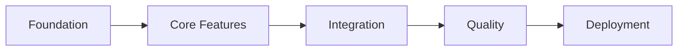

# Implementation Runbook Index

## Generated from: `/projects/pet-software-idler/petsoft-tycoon-advanced-prd-technical-requirements.md`
## Generated on: 2025-08-06

## Overview
This runbook provides a phased implementation approach for PetSoft Tycoon, an idle/incremental game built with React Native, Expo, and Legend State. The runbook is organized into discrete phases to manage token usage and enable parallel development.

## Phase Files

### 📋 [Phase 0: Analysis](./00-analysis.md)
**Purpose:** Requirements extraction and project overview  
**Duration:** Reference document  
**Key Outputs:**
- Business objectives and metrics
- Technical architecture decisions
- Feature prioritization
- Resource requirements

### 🏗️ [Phase 1: Foundation](./01-foundation.md)
**Purpose:** Environment and structure setup  
**Duration:** 5-7 hours  
**Key Tasks:**
- Expo project initialization
- TypeScript configuration
- Legend State integration
- Project structure creation
- Testing framework setup

### ⚙️ [Phase 2: Core Features](./02-core-features.md)
**Purpose:** Primary functionality implementation  
**Duration:** 25-35 hours  
**Key Tasks:**
- Core gameplay loop
- Department systems
- Prestige mechanics
- Visual/audio feedback
- Save system

### 🔗 [Phase 3: Integration](./03-integration.md)
**Purpose:** Component connections and synergies  
**Duration:** 20-28 hours  
**Key Tasks:**
- Department synergies
- Prestige integration
- Offline progression
- Office evolution
- Achievement system

### ✅ [Phase 4: Quality](./04-quality.md)
**Purpose:** Testing and validation  
**Duration:** 30-40 hours  
**Key Tasks:**
- Unit testing (80% coverage)
- Integration testing
- E2E testing with Maestro
- Performance optimization
- Cross-platform testing

### 🚀 [Phase 5: Deployment](./05-deployment.md)
**Purpose:** Release preparation  
**Duration:** 15-20 hours  
**Key Tasks:**
- Build configuration
- Deployment pipeline
- Monitoring setup
- Documentation
- Launch preparation

## Phase Dependencies



**Critical Path:**
1. **Foundation** → Core Features (blocks all development)
2. **Core Features** → Integration (requires base functionality)
3. **Integration** → Quality (needs complete system)
4. **Quality** → Deployment (requires tested application)

**Parallel Work Opportunities:**
- Documentation can proceed alongside development
- UI polish can happen during integration
- Performance monitoring setup during quality phase

## Progress Tracking

### Quick Status Check
Run the progress tracking script to see current completion:
```bash
./runbook-progress.sh projects/pet-software-idler/runbook
```

### Manual Progress Tracking
Track completion in `progress.json`:
```json
{
  "phases": {
    "foundation": { "status": "pending", "completed_tasks": 0, "total_tasks": 10 },
    "core_features": { "status": "pending", "completed_tasks": 0, "total_tasks": 15 },
    "integration": { "status": "pending", "completed_tasks": 0, "total_tasks": 12 },
    "quality": { "status": "pending", "completed_tasks": 0, "total_tasks": 10 },
    "deployment": { "status": "pending", "completed_tasks": 0, "total_tasks": 8 }
  }
}
```

## Time Estimates

| Phase | Min Hours | Max Hours | Dependencies |
|-------|-----------|-----------|--------------|
| Foundation | 5 | 7 | None |
| Core Features | 25 | 35 | Foundation |
| Integration | 20 | 28 | Core Features |
| Quality | 30 | 40 | Integration |
| Deployment | 15 | 20 | Quality |
| **Total** | **95** | **130** | - |

**Recommended Schedule (4-6 weeks):**
- Week 1: Foundation + Start Core Features
- Week 2: Complete Core Features
- Week 3: Integration + Start Quality
- Week 4: Complete Quality
- Week 5: Deployment + Soft Launch
- Week 6: Buffer for issues + Full Launch

## Key Technologies

### Core Stack
- **Framework:** React Native + Expo
- **State Management:** Legend State (4KB, automatic persistence)
- **Type Safety:** TypeScript (strict mode)
- **Testing:** React Native Testing Library + Maestro

### Development Tools
- **Build System:** Expo EAS
- **Version Control:** Git
- **CI/CD:** GitHub Actions
- **Monitoring:** Custom analytics + error reporting

## Success Metrics

### Performance Requirements
- ✓ 60 FPS consistently
- ✓ <50ms interaction response
- ✓ <50MB memory usage
- ✓ <3 second load time

### Quality Standards
- ✓ 80%+ test coverage
- ✓ 90%+ TypeScript coverage
- ✓ Zero P0/P1 bugs
- ✓ Cross-platform compatibility

### Business Metrics
- ✓ >40% D1 retention
- ✓ >90% tutorial completion
- ✓ <1% bug report rate

## Common Commands

```bash
# Development
npx expo start              # Start dev server
npm test                    # Run tests
npm run lint               # Check code quality
npx tsc --noEmit          # Type check

# Building
npx expo export:web       # Build for web
eas build --platform ios  # Build for iOS
eas build --platform android # Build for Android

# Deployment
npm run deploy            # Deploy to production
npm run rollback         # Rollback deployment
```

## Troubleshooting

### Common Issues
| Issue | Solution |
|-------|----------|
| Expo CLI not found | Use `npx expo` instead |
| TypeScript errors | Check `tsconfig.json` strict settings |
| Legend State not persisting | Ensure AsyncStorage installed |
| Tests failing | Check Jest configuration |
| Build too large | Enable code splitting |

## Next Steps

1. **Review Phase 0** for requirements understanding
2. **Start Phase 1** to set up development environment
3. **Follow phases sequentially** for best results
4. **Track progress** using the provided script
5. **Refer back to this index** for coordination

## Support Resources

- [Expo Documentation](https://docs.expo.dev)
- [Legend State Docs](https://legendapp.com/open-source/state)
- [React Native Testing Library](https://callstack.github.io/react-native-testing-library)
- [Maestro Testing](https://maestro.mobile.dev)

---

*This runbook follows chunked generation principles to manage token usage efficiently while maintaining comprehensive implementation guidance.*