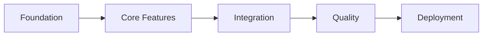

# PetSoft Tycoon Implementation Runbook

## Generated from: petsoft-tycoon-advanced-prd-technical-requirements.md
## Generated on: 2025-08-08
## Platform Decision: React Native with Expo SDK

## ⚠️ Critical Platform Note
The original PRD specified a web-based vanilla JavaScript game. This runbook implements with React Native/Expo for cross-platform mobile capability based on research stack validation. The 4-week timeline remains achievable using Expo's rapid development tools.

## Phase Files
1. [Analysis](./00-analysis.md) - Requirements extraction and research validation
2. [Foundation](./01-foundation.md) - Project setup and core infrastructure (5.5 hours)
3. [Core Features](./02-core-features.md) - Primary gameplay implementation (7.5 hours)
4. [Integration](./03-integration.md) - Feature connections and synergies (5.5 hours)
5. [Quality](./04-quality.md) - Testing and performance optimization (7 hours)
6. [Deployment](./05-deployment.md) - Build and release preparation (7.5 hours)

## Research Validation Status
✅ **All packages validated against research/**
- @legendapp/state: @beta (research/tech/legend-state.md)
- React Native: 0.76.0 (research/tech/react-native.md)
- Expo SDK: ~52.0.0 (research/tech/expo.md)
- TypeScript: ^5.8.0 (research/tech/typescript.md)

✅ **Architecture patterns enforced**
- Vertical slicing (research/planning/vertical-slicing.md)
- Modular observables (research/tech/legend-state.md)
- Custom hooks pattern (research/tech/react-native.md)

## Phase Dependencies


## Quick Start Commands
```bash
# Initialize project (Phase 1)
npx create-expo-app PetSoftTycoon --template expo-template-blank-typescript
cd PetSoftTycoon

# Install core dependencies (Phase 1)
npm install @legendapp/state@beta react-native-mmkv
npm install react-native-reanimated@~3.10.0 expo-av@~14.0.0

# Start development
npx expo start

# Run tests
npm test

# Build for production (Phase 5)
eas build --platform all --profile production
```

## Architecture Overview
```
src/
├── features/              # Vertical slices
│   ├── codeProduction/   # Complete feature
│   │   ├── components/
│   │   ├── hooks/
│   │   ├── services/
│   │   └── state/
│   ├── departments/
│   ├── featureShipping/
│   ├── prestige/
│   └── achievements/
├── shared/               # Cross-cutting only
│   ├── components/
│   ├── hooks/
│   └── types/
└── app/                  # Composition layer
    ├── store/           # State composition
    └── screens/         # Screen components
```

## Progress Tracking
Use the progress tracking script to monitor completion:
```bash
./runbook-progress.sh
```

Or manually track in `progress.json`:
```json
{
  "currentPhase": 1,
  "completedTasks": [],
  "blockers": [],
  "notes": ""
}
```

## Development Timeline

### Week 1: Foundation + Core
- **Day 1-2**: Phase 1 - Foundation (5.5 hours)
- **Day 3-5**: Phase 2 - Core Features (7.5 hours)

### Week 2: Integration + Polish
- **Day 6-7**: Phase 3 - Integration (5.5 hours)
- **Day 8-9**: Phase 4 - Quality (7 hours)

### Week 3: Testing + Deployment
- **Day 10-12**: Complete testing, bug fixes
- **Day 13-14**: Phase 5 - Deployment (7.5 hours)

### Week 4: Polish + Launch
- **Day 15-17**: Final polish, balance tuning
- **Day 18-19**: Store submissions
- **Day 20**: Launch preparation

## Key Implementation Decisions

### State Management
Using Legend State v3 (@beta) with modular observables:
- Feature-specific state slices
- Composition at app level
- MMKV persistence
- Computed values for derived state

### Performance Targets
- 60 FPS on mid-range devices (A12 Bionic / Snapdragon 855)
- <150MB memory usage
- <16ms input response time
- <3 second cold start

### Testing Strategy
- Unit tests with Jest (>80% coverage)
- Integration tests for features
- E2E tests with Maestro
- Performance profiling throughout

## Risk Mitigation

### High Priority
1. **Platform Change Risk**: Using React Native instead of vanilla JS
   - Mitigation: Expo's tools accelerate development
   
2. **Performance Risk**: 60 FPS target on older devices
   - Mitigation: Continuous profiling, React.memo, optimization

### Medium Priority
1. **State Complexity**: Legend State learning curve
   - Mitigation: Start simple, refactor as needed
   
2. **Cross-Platform Issues**: iOS/Android differences
   - Mitigation: Regular testing on both platforms

## Success Criteria
- [ ] All user stories implemented
- [ ] 60 FPS performance achieved
- [ ] Test coverage >80%
- [ ] iOS and Android builds working
- [ ] Store submissions approved
- [ ] Offline progression functional
- [ ] Save system reliable

## Support Resources
- [Expo Documentation](https://docs.expo.dev)
- [Legend State v3 Docs](https://legendapp.com/open-source/state/v3)
- [React Native Testing Library](https://callstack.github.io/react-native-testing-library/)
- [Maestro Documentation](https://maestro.mobile.dev)

## Notes
- This runbook follows research-validated patterns and package versions
- Architecture enforces vertical slicing with no horizontal layers
- All state management uses modular observables
- Custom hooks required for React logic (no utils)

---

*Total Estimated Development Time: 33 hours*
*Recommended Schedule: 4 weeks with buffer for testing and polish*