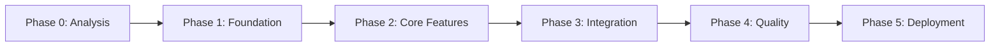

# Implementation Runbook: PetSoft Tycoon MVP

## Generated from: projects/pet-software-idler/petsoft-tycoon-advanced-prd-technical-requirements.md
## Generated on: 2025-08-07
## Project: PST-2025-MVP

---

## ⚠️ CRITICAL DECISION REQUIRED

**Architecture Mismatch Detected:**
- PRD Specification: Web-based HTML5/JavaScript with vanilla JS
- Framework Context: React Native/Expo mobile development
- **Action Required:** Resolve technology stack before starting Phase 1

---

## Phase Files

### 📋 [Phase 0: Analysis](./00-analysis.md)
**Status:** Complete  
**Purpose:** Requirements extraction and overview  
**Key Output:** Architecture decision needed, resource requirements identified

### 🏗️ [Phase 1: Foundation](./01-foundation.md)
**Status:** Ready to Start  
**Duration:** 6-8 hours  
**Purpose:** Environment setup and project structure  
**Prerequisites:** Architecture decision from Phase 0

### ⚙️ [Phase 2: Core Features](./02-core-features.md)
**Status:** Pending  
**Duration:** 12-14 hours  
**Purpose:** Primary game functionality implementation  
**Prerequisites:** Completed Phase 1

### 🔗 [Phase 3: Integration](./03-integration.md)
**Status:** Pending  
**Duration:** 10-12 hours  
**Purpose:** Component connections and advanced features  
**Prerequisites:** Completed Phase 2

### ✅ [Phase 4: Quality](./04-quality.md)
**Status:** Pending  
**Duration:** 20-22 hours  
**Purpose:** Testing, optimization, and polish  
**Prerequisites:** Completed Phase 3

### 🚀 [Phase 5: Deployment](./05-deployment.md)
**Status:** Pending  
**Duration:** 8-10 hours  
**Purpose:** Release preparation and launch  
**Prerequisites:** Completed Phase 4

---

## Phase Dependencies



## Timeline Overview

| Phase | Duration | Dependencies | Critical Path |
|-------|----------|--------------|---------------|
| **Phase 0** | Complete | None | ✅ Complete |
| **Phase 1** | 6-8 hours | Architecture decision | ⚠️ Blocked |
| **Phase 2** | 12-14 hours | Phase 1 | Yes |
| **Phase 3** | 10-12 hours | Phase 2 | Yes |
| **Phase 4** | 20-22 hours | Phase 3 | Yes |
| **Phase 5** | 8-10 hours | Phase 4 | Yes |
| **Total** | 56-66 hours | - | - |

## Progress Tracking

Use the progress tracking script to monitor completion:

```bash
# Check overall progress
./runbook-progress.sh

# Check specific phase
./runbook-progress.sh --phase 1

# Mark task complete
./runbook-progress.sh --complete 1.1.1
```

## Quick Start Guide

### 1. Resolve Architecture Decision
Before starting implementation, decide between:
- **Option A:** Vanilla JavaScript (as specified in PRD)
- **Option B:** React with Legend State
- **Option C:** React Native/Expo for cross-platform

### 2. Begin Phase 1
```bash
# Install dependencies based on decision
npm init
npm install [chosen-framework-packages]

# Follow Phase 1 runbook
open ./01-foundation.md
```

### 3. Validate Each Phase
After completing each phase:
1. Run phase-specific tests
2. Verify deliverables checklist
3. Check performance metrics
4. Document any deviations

### 4. Continuous Integration
```bash
# Run tests continuously
npm test --watch

# Check performance
npm run perf-test

# Validate build
npm run build
```

## Key Success Metrics

### Technical Metrics
- ✅ 60 FPS during gameplay
- ✅ <50ms response time
- ✅ <3MB initial bundle
- ✅ <50MB memory usage

### Quality Metrics
- ✅ 70% test coverage
- ✅ Zero critical bugs
- ✅ WCAG 2.1 AA compliance
- ✅ Cross-browser support

### Business Metrics
- ✅ D1 retention >40%
- ✅ Average session >8 minutes
- ✅ 90% tutorial completion
- ✅ 60% first prestige

## Architecture Patterns (Mandatory)

### Feature-Based Structure
All code MUST follow feature-based organization:
```
src/features/
  ├── codeProduction/
  ├── departments/
  ├── prestige/
  └── achievements/
```

### State Management
MUST use Legend State reactive patterns:
```typescript
const state$ = observable({...});
const computed$ = observable(() => derivedValue);
```

### Testing Strategy
MUST test user behavior, not implementation:
```typescript
// Good: Test what user sees
expect(screen.getByText(/lines: 42/i)).toBeInTheDocument();

// Bad: Test internal state
expect(component.state.lines).toBe(42);
```

## Risk Register

| Risk | Impact | Probability | Mitigation |
|------|--------|-------------|------------|
| Architecture mismatch | High | Current | Immediate decision required |
| Performance issues | High | Medium | Early profiling, optimization |
| Offline progression bugs | High | Medium | Comprehensive testing |
| Save corruption | High | Low | Multiple backup strategies |

## Support Resources

### Documentation
- [Legend State Docs](https://legendapp.com/open-source/state/)
- [React Testing Library](https://testing-library.com/react)
- [Vite Configuration](https://vitejs.dev/config/)

### Team Contacts
- Technical Lead: [Pending assignment]
- QA Lead: [Pending assignment]
- Product Owner: [Pending assignment]

## Phase Completion Criteria

Each phase is complete when:
1. ✅ All tasks in phase runbook completed
2. ✅ Deliverables checklist verified
3. ✅ Tests passing for phase features
4. ✅ Performance metrics met
5. ✅ No blocking issues for next phase

## Notes and Decisions Log

### 2025-08-07: Initial Generation
- Runbook generated from PRD v1.1
- Architecture decision pending
- Phases structured for incremental delivery

### Pending Decisions
- [ ] Technology stack (Vanilla JS vs React vs React Native)
- [ ] Hosting provider selection
- [ ] Analytics provider choice
- [ ] Error tracking service

---

## Commands Reference

```bash
# Development
npm run dev           # Start dev server
npm test             # Run tests
npm run build        # Production build

# Quality
npm run lint         # Check code style
npm run type-check   # TypeScript validation
npm run test:e2e     # End-to-end tests

# Deployment
npm run deploy:staging    # Deploy to staging
npm run deploy:production # Deploy to production
```

---

**Remember:** This is a living document. Update progress daily and document any deviations from the plan.

🤖 Generated with [Claude Code](https://claude.ai/code)

Co-Authored-By: Claude <noreply@anthropic.com>